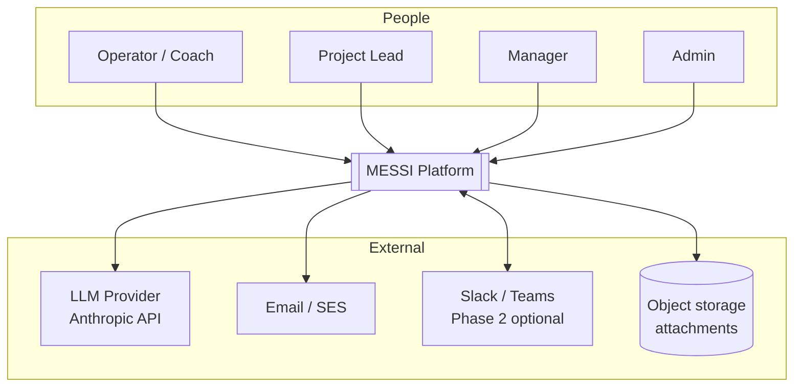
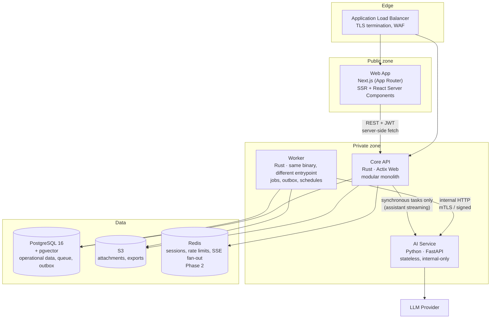
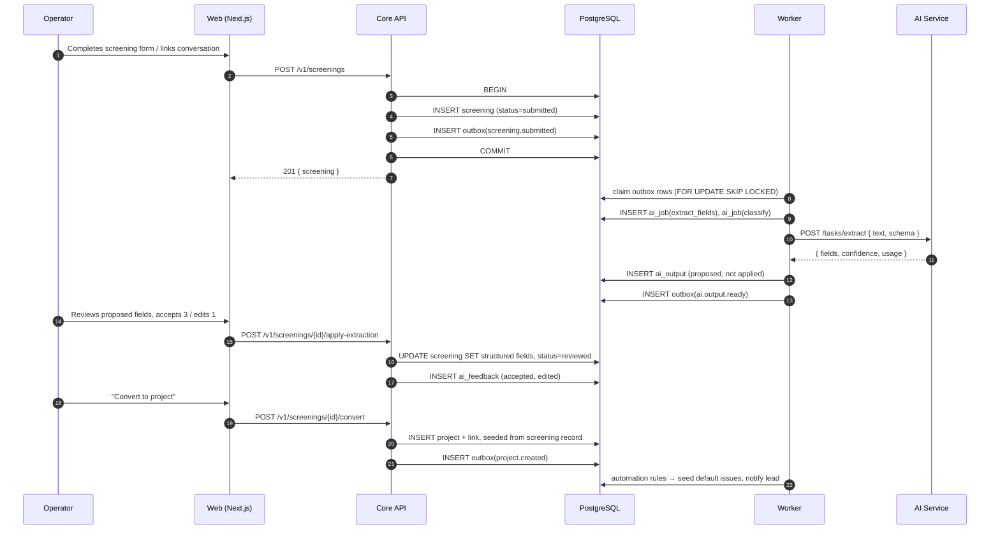
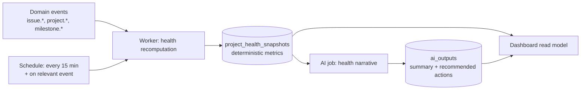

# 02 — Architecture

## 2.1 System context



MESSI is the system of record for screening and delivery. It is *not* the system of record
for identity (Phase 3 delegates to an IdP) or for company-wide chat.

## 2.2 Container view



### Why these boundaries

| Boundary | Reason |
|---|---|
| Web ↔ API | The browser never holds a long-lived credential for the API; Next.js server components hold the session and proxy. |
| API ↔ Worker | Same codebase and domain logic, separate scaling and failure domain. A stuck AI job cannot exhaust request threads. See [ADR-0001](adr/0001-modular-monolith-in-rust.md). |
| Worker/API ↔ AI Service | Model and prompt iteration happens in Python at Python's pace, without recompiling or redeploying the transactional core. See [ADR-0003](adr/0003-separate-python-ai-service.md). |
| AI Service ↔ Database | **Deliberately absent.** The AI service has no database credentials. Authorization lives in exactly one place. |

That last row is the most important line in this document. The AI service receives a
payload and returns a result. Everything it is allowed to see was already
authorization-filtered by the Core API. This makes prompt injection an *content* problem
rather than an *access control* problem.

## 2.3 Core API internal structure

A modular monolith. Modules communicate through domain events and typed service
interfaces, never by reaching into each other's tables.

```
crates/
├── messi-domain/        # entities, value objects, state machines. No I/O, no framework.
├── messi-app/           # use cases; orchestrates domain + ports. Transaction boundaries live here.
├── messi-infra/         # sqlx repositories, S3, AI client, mail, clock, id generation.
├── messi-api/           # Actix Web: routing, extractors, DTOs, OpenAPI, authn middleware.
├── messi-worker/        # job runners, outbox dispatcher, cron schedules.
└── messi-contracts/     # shared DTO + event schemas; source for OpenAPI + TS type generation.

modules (feature slices inside domain/app):
  identity   organizations, users, roles, sessions, memberships
  customers  customer + contact records
  screening  templates, submissions, screening records, review
  projects   projects, milestones, membership, health snapshots
  issues     issues, comments, transitions, labels
  messaging  conversations, messages, participants, links to objects
  ai         ai_jobs, ai_outputs, feedback, budgets
  automation rules, triggers, actions, notifications
  insights   KPI aggregation, dashboards, exports
```

**Dependency rule:** `api → app → domain`, `infra → domain`, nothing depends on `api`.
The domain crate has no `sqlx`, no `actix`, no `tokio` in its dependency tree — enforced in
CI by `cargo-deny`/`cargo tree` assertions so the rule is not merely aspirational.

### Ports the application layer depends on

```rust
// messi-app/src/ports.rs  (illustrative)
#[async_trait]
pub trait AiTaskRunner {
    async fn run(&self, task: AiTask) -> Result<AiOutcome, AiError>;
}

#[async_trait]
pub trait EventPublisher {
    /// Enqueues into the transactional outbox. Must join the caller's transaction.
    async fn publish(&self, tx: &mut Tx<'_>, event: DomainEvent) -> Result<(), AppError>;
}

#[async_trait]
pub trait Clock { fn now(&self) -> DateTime<Utc>; }
```

Tests substitute in-memory implementations; the domain's state machines are exercised
without a database or a model provider.

## 2.4 The core workflow, as a sequence

The proposal's five-step chain, expressed as the actual traversal through the system.



Step 3 is where the proposal's promise is kept: the project is created *from* the
screening record, so nothing is re-entered. Step "apply-extraction" is where
[ADR-0005](adr/0005-ai-proposes-humans-dispose.md) is enforced — the model's
output sat in `ai_outputs` and only a human action moved it into the business record.

## 2.5 Read path for the manager dashboard

Project health must render "in seconds" (proposal, slide 6). It is therefore *precomputed*,
not calculated per request.



The split matters. **Status, progress %, open issue count, blocker count and overdue items
are computed by deterministic SQL.** The AI writes only the narrative paragraph and the
ranked recommended actions on slide 6. If the AI layer is unavailable, the dashboard still
shows correct numbers with the narrative absent — a degradation, not an outage.
See [ADR-0006](adr/0006-deterministic-health-ai-narrative.md).

## 2.6 Frontend architecture

- **Next.js App Router**, React Server Components for data-heavy views, Client Components
  for interactive editors.
- **Session held server-side.** An httpOnly, `SameSite=Lax` cookie holds an opaque session
  id; server components exchange it for a short-lived API token. No JWT in `localStorage`.
- **Route groups** mirror the domain modules: `(screening)`, `(projects)`, `(issues)`,
  `(messenger)`, `(admin)`, `(insights)`.
- **Typed client generated from OpenAPI** — the Rust API is the single source of truth for
  DTOs; a CI step regenerates TypeScript types and fails the build on drift.
- **Server Actions** for mutations, forwarding to the REST API with the request-scoped
  token; no direct database access from the web tier, ever.
- **Streaming** for the AI assistant via SSE proxied through a Next.js route handler.
- **Optimistic UI** for issue transitions and assignment (the highest-frequency actions),
  reconciled against the returned entity version.

## 2.7 Environments

| Environment | Purpose | Data | AI provider |
|---|---|---|---|
| `local` | Developer machines | Seeded fixtures | Recorded fixtures by default; live behind a flag |
| `ci` | Automated tests | Ephemeral Postgres per run | Stub runner only — never a live provider |
| `staging` | Pre-release verification | Anonymized copy | Live, small model tier, tight budget |
| `production` | Pilot users | Real | Live, full tiering |

## 2.8 What we deliberately did not build

| Rejected | Why |
|---|---|
| Microservices per module | 25 pilot users. Distributed transactions and 6 deploy pipelines buy nothing here, and the module boundaries above make extraction cheap when a real reason appears. |
| Kafka / RabbitMQ | Postgres `SKIP LOCKED` handles far more than this workload and removes an operational component. Revisit at sustained >100 jobs/s. See [ADR-0004](adr/0004-postgres-backed-jobs-and-outbox.md). |
| GraphQL | The client is one first-party app with a known screen inventory. REST + generated types is less machinery. |
| Separate vector database | pgvector in the same instance keeps embeddings inside the same transaction and the same backup. Revisit above ~10⁶ vectors. |
| Event sourcing | The `events` table gives us auditability and automation triggers without rebuilding read models from a log. |
