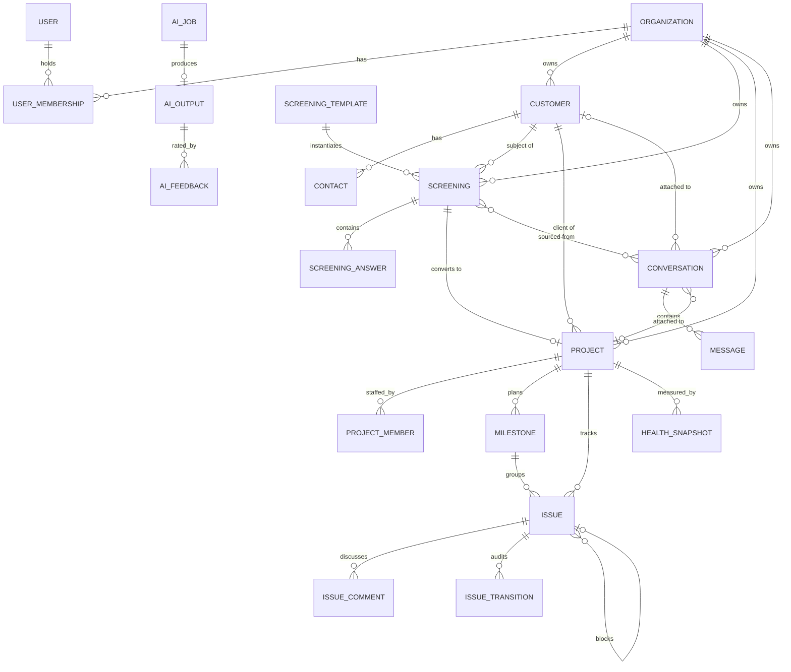
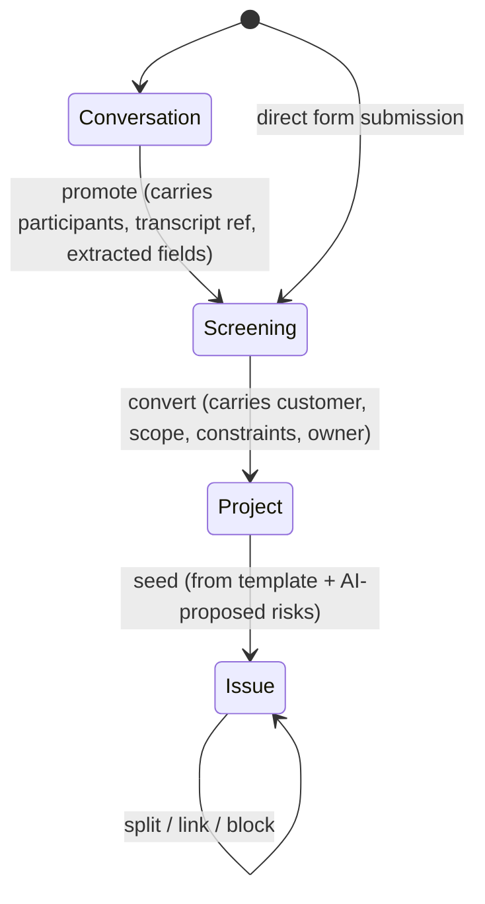
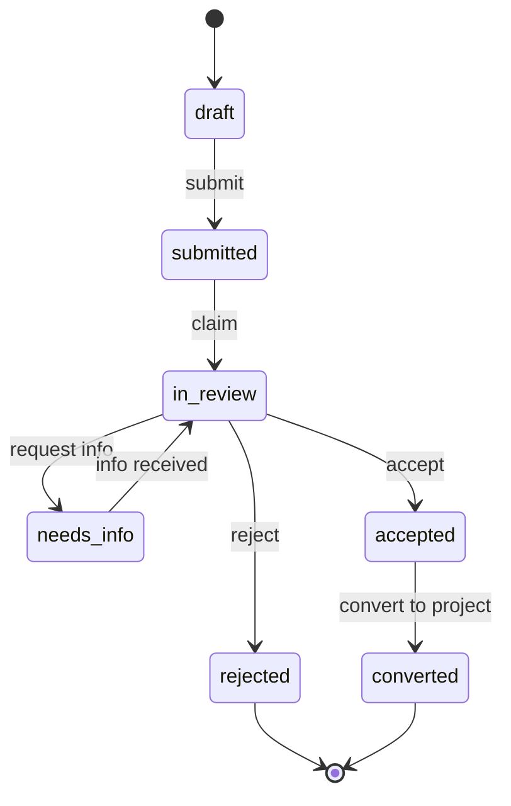
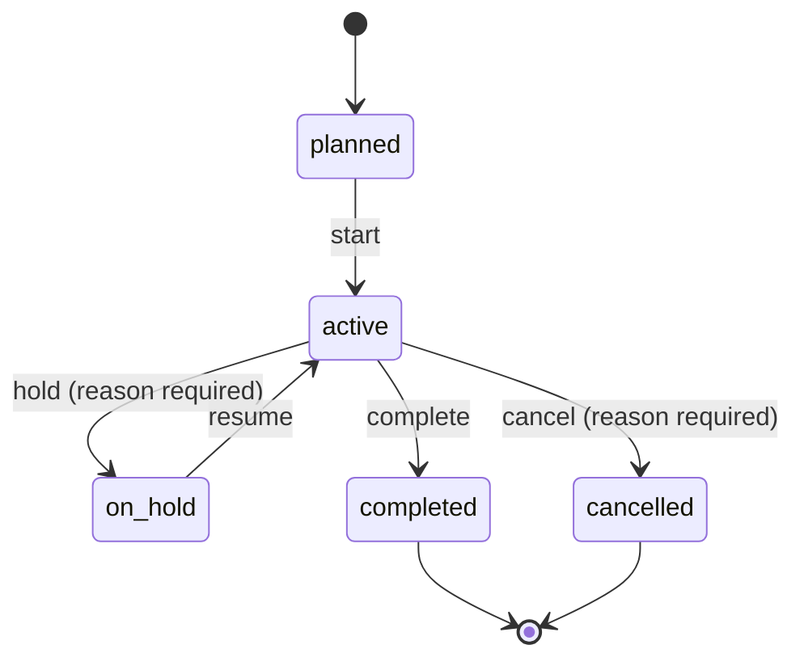
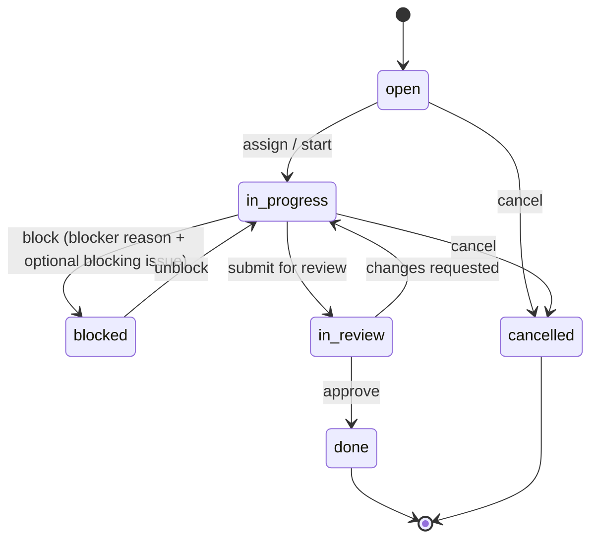

# 03 — Domain Model

## 3.1 Entity relationships

Every entity above except `USER` and `ORGANIZATION` carries an `organization_id`.

## 3.2 The conversion chain

The proposal's central claim is that information flows forward without re-entry. Three
conversions implement it. Each is a first-class, audited operation — not a copy-paste
convenience.

### Conversion invariants

1. **Provenance is permanent.** Every converted object stores `source_type` +
   `source_id`. Opening a project shows the screening it came from; opening a screening
   shows the conversation it came from. Deleting a source soft-deletes and keeps the link.
2. **Conversion is idempotent per source.** A unique index on `(source_type, source_id, target_kind)`
   prevents the double-click that creates two projects from one screening.
3. **Field mapping is declarative.** A screening template declares which answers map to
   which project/customer fields. The mapping is data, so a Phase 3 tenant can change it
   without a deploy.
4. **Conversion never silently drops data.** Answers without a mapping target are carried
   into the project's `context` JSONB and rendered in a "from screening" panel.

## 3.3 Screening

> **Superseded in part by [doc 14](14-followup-engine.md).** Screening is one instance of the
> follow-up engine — a module with `cadence.kind = "once"`. The concepts below (versioned
> question sets, typed answers, deterministic scoring, conversion) are correct and carry
> over unchanged; what changed is that they are no longer screening-specific. MESSI itself
> is *messenger screening*: a recurring daily module, not a one-shot intake form. See
> [ADR-0007](adr/0007-followup-cycles-generalize-screening.md).

The domain object that most directly replaces manual work.

| Concept | Definition |
|---|---|
| **Screening template** | Versioned definition: sections, questions, types, validation, scoring rules, extraction schema, field mapping. Immutable once used; edits create a new version. |
| **Screening** | One instance against one template version, for one customer. |
| **Answer** | Typed value per question. Stored both raw and normalized. |
| **Score** | Deterministic, computed from a rules expression on the template. **Never AI-generated** — a score that decides customer outcomes must be explainable and reproducible. |
| **Classification** | AI-proposed category/priority. Advisory, stored separately from score, requires acceptance. |

Definitions are versioned because a KPI computed across a changing instrument is not
comparable over time. Version pinning makes the pilot measurement honest — and in the
generalized engine, analysis groups by module version for exactly this reason
([doc 17](17-answer-analysis.md) §17.2).

## 3.4 Project

`status` (lifecycle, human-set) is strictly separate from `health` (derived, system-set).
Conflating them is the standard way this kind of dashboard becomes untrustworthy: a
project can be `active` and `at_risk` simultaneously, and a manager needs to see both.

### Health derivation

`health ∈ {on_track, at_risk, blocked, unknown}`, recomputed on relevant events and on a
15-minute schedule. Deterministic rules, evaluated in order — first match wins:

| Rank | Condition | Health |
|---|---|---|
| 1 | ≥1 open issue with `severity = critical` and `is_blocker = true` | `blocked` |
| 2 | ≥1 blocker open > 3 business days | `blocked` |
| 3 | Milestone due within 7 days with < 60% of its issues closed | `at_risk` |
| 4 | Overdue issue count > 20% of open issues | `at_risk` |
| 5 | No activity (event) in 10 business days while `active` | `at_risk` |
| 6 | Health inputs incomplete (no milestones, no issues) | `unknown` |
| 7 | otherwise | `on_track` |

Thresholds live in `organization_settings`, not in code. Slide 6's "AT RISK / 68% / 4 open
/ 2 critical blockers" is produced entirely by these rules; only the paragraph beneath it
comes from a model ([ADR-0006](adr/0006-deterministic-health-ai-narrative.md)).

**Progress %** = weighted closed-issue ratio within the active milestone set, weighted by
issue `estimate` where present and by count where absent. One formula, documented in the
UI tooltip, so the number means the same thing in every project.

## 3.5 Issue

Attributes: `title`, `description`, `type` (task | bug | risk | decision | blocker),
`severity` (low | medium | high | critical), `priority` (P0–P3), `assignee_id`, `due_at`,
`estimate`, `labels[]`, `milestone_id`, `blocked_by[]`.

**Ownership rule:** an issue in `in_progress`, `blocked` or `in_review` must have an
assignee. Enforced in the domain state machine, not by UI validation. This is the
mechanism behind the "↑ issue ownership" KPI — unowned in-flight work becomes
*representationally impossible* rather than merely discouraged.

Every transition writes an `issue_transitions` row with actor, timestamp, from/to and
optional reason. These rows are the sole source for the "issue resolution time" KPI, so the
measurement cannot drift from the workflow.

## 3.6 Messaging

- **Conversation** — a thread with participants, optionally attached to a customer,
  project or issue. `channel ∈ {internal, email, imported}`.
- **Message** — author (user or external contact), body, attachments, `sent_at`.
- **Attachment link** — a conversation may be cited as the source of a screening, and
  individual messages may be cited as evidence in an AI summary.

Phase 1 ships internal conversations only. Phase 2 adds inbound email ingestion and
optional Slack/Teams mirroring through an adapter that normalizes into the same
`conversations`/`messages` tables — so downstream AI and screening logic is unchanged by
where a message originated.

## 3.7 AI artefacts as domain objects

AI results are entities, not transient responses. This is what makes them auditable,
reviewable and measurable.

| Entity | Purpose |
|---|---|
| `ai_job` | A requested task: type, subject reference, input digest, status, cost, latency, model, prompt version |
| `ai_output` | The produced result: structured payload, confidence, citations, `applied_at`, `applied_by` |
| `ai_feedback` | Human disposition: accepted / edited / rejected, plus the edited value |

`ai_feedback` is the quality dataset. Without it there is no way to answer "is the
classifier actually good?" six weeks into the pilot — which is the question that decides
whether Phase 2 justified itself.

## 3.8 Cross-cutting concepts

- **Soft delete.** `deleted_at` on business entities; hard delete reserved for GDPR erasure
  ([doc 08](08-security-and-tenancy.md)).
- **Optimistic concurrency.** Every mutable entity has `version`; updates require the
  client's version and return `409` on mismatch.
- **Audit.** Every state-changing operation appends to `events` with actor, entity,
  before/after diff and request id.
- **Custom fields.** `attributes JSONB` on customer, screening, project and issue, with a
  per-organization schema registry. Keeps Phase 3 "custom workflows" from requiring
  migrations, without abandoning typed columns for the fields every tenant shares.
