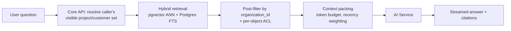

# 06 — AI Layer

> "Use AI only for high-value tasks; keep deterministic workflows in normal software."
> — proposal, slide 11

That sentence is the whole design brief for this layer. What follows is how it is enforced
structurally rather than by discipline.

## 6.1 The line between AI and software

| Belongs to deterministic software | Belongs to AI |
|---|---|
| Screening score and pass/fail | Draft classification suggestion |
| Project status, progress %, issue counts, overdue detection, blocker detection ([ADR-0006](adr/0006-deterministic-health-ai-narrative.md)) | The narrative explaining them |
| State transitions and permissions | Ranked suggested next actions |
| Notification routing and rule evaluation | Summarizing what a notification is about |
| Search filters, sorting, aggregation | Semantic retrieval for the assistant |
| Anything a customer outcome or a KPI depends on | Anything a human reads and judges |

**Test applied to every proposed AI feature:** *if the model returned confident nonsense,
would a wrong business outcome occur without a human noticing?* If yes, it is not an AI
feature — it is a software feature that may be AI-*assisted* behind an explicit review
step.

## 6.2 The six tasks

| Task | Trigger | Input | Output | Disposition |
|---|---|---|---|---|
| `summarize` | Conversation closed, thread > N messages, weekly digest, on demand | Messages + metadata | Summary, decisions, open questions, action candidates | Displayed; actions require one click to become issues |
| `classify` | Screening submitted; issue created | Screening answers / issue text | Category, priority, severity + confidence | **Proposal only** — written to `ai_outputs`, applied by human or by a rule above a confidence threshold |
| `extract` | Conversation promoted; document attached; screening submitted | Free text + target JSON Schema | Field values with per-field confidence and source quotes | Reviewed field-by-field via `apply-extraction` |
| `project_health` | New health snapshot with changed inputs; ≤ 1× per project per 15 min | Deterministic snapshot + recent events + open blockers | Narrative + ranked recommended actions | Displayed alongside the deterministic numbers |
| `assistant` | User question | Question + authorization-filtered retrieved context | Streamed answer with citations | Read-only; the assistant cannot mutate anything |
| `embed` | Entity created/updated | Text chunk | Vector | Internal |

Note what is absent: no AI-set status, no AI-sent external message, no AI-assigned owner,
no AI-closed issue. Phase 2 stops short of autonomous action deliberately
([ADR-0005](adr/0005-ai-proposes-humans-dispose.md)).

## 6.3 Execution flow

```mermaid
sequenceDiagram
    participant API as Core API
    participant DB as PostgreSQL
    participant WK as Worker
    participant AI as AI Service
    participant P as LLM Provider

    API->>DB: INSERT ai_job(queued, input_digest)
    Note over API,DB: digest = sha256(normalized input + prompt_version + model tier)
    DB-->>API: cache hit? reuse prior ai_output, status='succeeded', cost 0

    WK->>DB: claim job (SKIP LOCKED)
    WK->>DB: check org monthly budget
    alt over budget
        WK->>DB: status='skipped_budget'; notify admin
    else within budget
        WK->>AI: POST /internal/tasks/{type}
        AI->>AI: render prompt (versioned) + attach JSON Schema
        AI->>P: model call, structured output enforced
        P-->>AI: JSON
        AI->>AI: validate vs schema; one repair retry on failure
        AI-->>WK: output + confidence + citations + usage
        WK->>DB: INSERT ai_output; UPDATE ai_job(cost, tokens, latency)
        WK->>DB: INSERT outbox('ai.output.ready')
    end
```

### Retries and failure

| Failure | Response |
|---|---|
| Provider timeout / 5xx / 429 | Retry ×3, exponential backoff with jitter, `Retry-After` respected |
| Schema validation failure | One repair attempt with the validation error appended; then fail |
| Repeated failure | `ai_job.status='failed'`; the *record stays usable* — the UI shows "summary unavailable, retry" |
| Budget exhausted | `skipped_budget`, admin notified, no silent degradation |

A failed AI job never blocks a business operation. There is no code path where a screening
cannot be submitted or an issue cannot be closed because a model was unavailable.

## 6.4 Cost control

Cost is a first-class design concern, not an afterthought — the proposal names it as
risk #2.

1. **Content-addressed caching.** `input_digest = sha256(normalized_input ‖ prompt_version ‖ model_tier)`.
   Re-opening a project that has not changed returns the stored output at zero cost. Expected
   to remove the majority of health-narrative calls, which are the highest-frequency task.
2. **Model tiering.** `classify` and `extract` run on a small/fast tier; `project_health`,
   `summarize` and `assistant` run on a standard tier. Tier is per task type in
   configuration, changeable without a deploy.
3. **Input budgets.** Hard token ceilings per task; conversations over the ceiling are
   summarized hierarchically (map-reduce over chunks) rather than truncated silently.
4. **Debouncing.** Health narratives are rate-limited per project. A burst of 20 issue
   updates produces one narrative, not twenty.
5. **Per-organization monthly budget** in `organizations.ai_monthly_budget_micros`, checked
   before dispatch, with alerts at 50% / 80% / 100%.
6. **Cost attribution.** Every `ai_job` records tokens, model and `cost_micros`, so
   `GET /v1/ai/usage` can answer "what did AI cost us, per task type, this month" —
   the number the Phase 2 go/no-go decision needs.

Illustrative pilot arithmetic (25 users, 20 active projects, 40 screenings/month):

| Task | Calls/month | Avg tokens in/out | Tier | Est. cost |
|---|---|---|---|---|
| project_health | ~600 (after debounce + cache) | 3k / 300 | standard | dominant line item |
| summarize | ~300 | 6k / 500 | standard | second |
| extract | ~40 | 4k / 400 | small | minor |
| classify | ~250 | 1k / 100 | small | minor |
| assistant | ~200 | 8k / 600 | standard | variable |

The purpose of the table is not the estimate — it is that each row has a lever
(debounce interval, cache hit rate, tier, token ceiling) that can be pulled independently
once real numbers arrive.

## 6.5 Grounding and citations

Every non-trivial output carries citations into `ai_outputs.citations`:

```json
[{ "entity_type": "issue", "entity_id": "…", "quote": "Blocked awaiting client sign-off since 2026-08-04" }]
```

Rules:
- The prompt instructs the model to answer **only** from supplied context and to state
  "not in the available data" otherwise.
- The assistant refuses to answer where retrieval returned nothing above the relevance
  threshold, rather than answering from parametric knowledge.
- Citations are rendered as links in the UI. A summary a manager cannot click through to
  verify is a summary they will eventually stop trusting.

### Retrieval for the assistant



Retrieval happens in the **Core API**, which is the only component that knows the caller's
permissions. The AI service is handed a pre-authorized context bundle. This is why "ask
questions against authorized operational data" (slide 5) holds by construction: the model
is never in a position to retrieve something the user could not already read.

## 6.6 Prompt management

- Prompts are versioned files in the AI service repository (`prompts/{task}/{version}.md`),
  never database rows edited in production.
- `prompt_version` is stored on every `ai_job`, so any historical output can be traced to
  the exact instruction that produced it.
- Each task declares an output JSON Schema; structured-output mode is used where the
  provider supports it, with schema validation as the backstop either way.
- Changing a prompt version invalidates the content-addressed cache automatically, because
  the version is inside the digest.
- Prompt changes go through the same review and evaluation gate as code.

## 6.7 Evaluating quality

Without this section the AI layer cannot be defended at the Phase 2 review.

**Golden sets.** Per task, 30–50 hand-labeled examples drawn from real Lightrees data
(anonymized), checked into the AI service repository.

| Task | Metric | Ship gate |
|---|---|---|
| `classify` | Macro-F1 vs. human labels | ≥ 0.80, and calibrated: high-confidence predictions ≥ 0.90 precision |
| `extract` | Per-field exact/normalized match | ≥ 0.85 on required fields; ≥ 0.95 precision on high-confidence fields |
| `summarize` | Rubric scoring (faithfulness, coverage, brevity) by LLM judge, spot-checked by human | ≥ 4/5 mean, zero unsupported claims in the sample |
| `project_health` | Human agreement on recommended actions | ≥ 70% "would have done this" |
| `assistant` | Answer faithfulness + refusal correctness on unanswerable questions | ≥ 90% faithful, ≥ 80% correct refusal |

Evaluation runs in CI on every prompt or model change and posts a comparison against the
current production version. A regression blocks the change.

**Production signal.** `ai_feedback` gives a continuous, real acceptance rate per task
type. The metric that actually matters for the Phase 2 decision is
**edit-free acceptance rate** — the share of AI outputs a human takes without modification.
It is on the dashboard from day one of Phase 2.

## 6.8 Safety and abuse

| Risk | Control |
|---|---|
| Prompt injection via customer message content | AI service has no credentials and no tools; injected instructions cannot reach data or actions. Untrusted content is delimited and labeled as data in the prompt. Outputs are schema-validated, so injected free-form instructions cannot become an action. |
| Sensitive data leaving the estate | Provider configured with zero-retention terms; PII redaction pass on `extract`/`summarize` inputs for configured field types; per-org opt-out disables all model calls |
| Hallucinated facts in management summaries | Citations required; uncited claims flagged in the UI; deterministic numbers never sourced from the model |
| Over-reliance | Confidence and provenance shown everywhere; `ai_summary` visually distinguished from computed metrics |
| Cost exhaustion attack | Per-user and per-org rate limits, budget ceiling, queue depth limits |

## 6.9 AI service internals

```
ai-service/
├── app/
│   ├── main.py               FastAPI app, internal auth middleware
│   ├── tasks/                one module per task type
│   ├── providers/            provider abstraction (Anthropic first), retries, token accounting
│   ├── prompts/              versioned prompt templates + output JSON Schemas
│   ├── chunking.py           hierarchical summarization, token budgeting
│   ├── redaction.py          PII detection and masking
│   └── schemas.py            pydantic request/response envelopes
├── evals/
│   ├── datasets/             golden sets
│   ├── runners/              per-task evaluation
│   └── report.py             CI comparison output
└── tests/
```

The provider layer is an interface with a `record/replay` implementation used by CI, so the
test suite is deterministic, free and offline. Adding a second provider later is a new
module behind the same interface — nothing above it changes.
