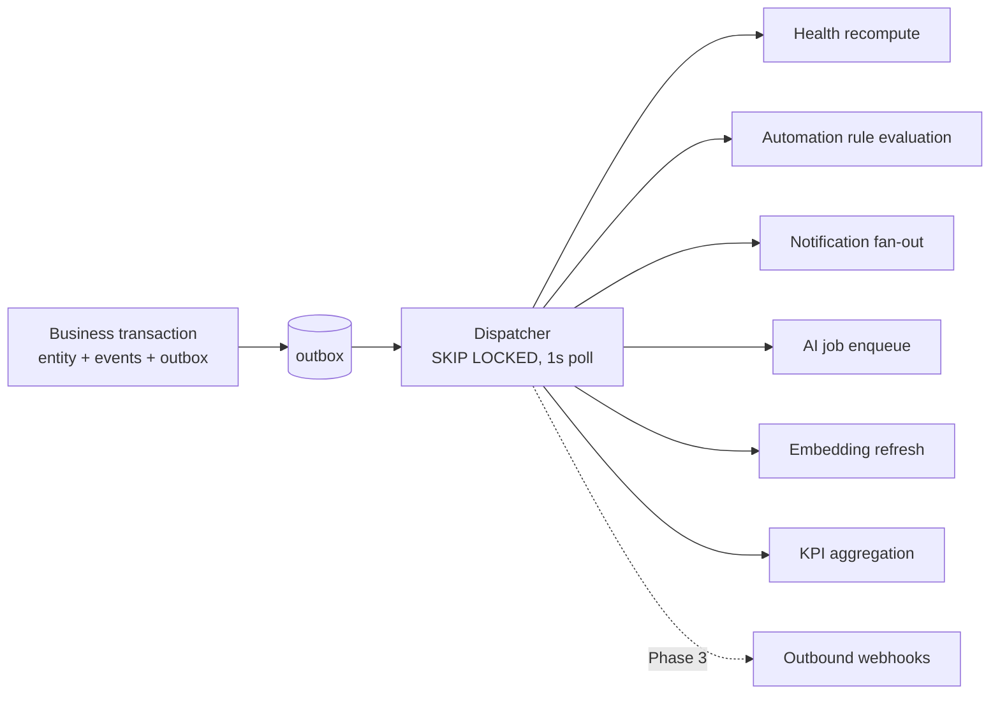
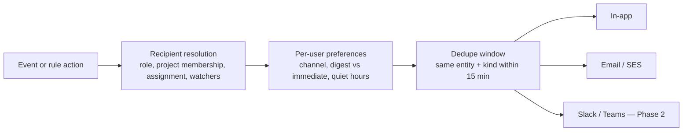

# 07 — Events & Automation

## 7.1 Why an event backbone at this size

Not for scale. For three properties the proposal's requirements depend on:

1. **Derived state that is never stale** — project health must react to work, not to
   someone remembering to refresh.
2. **Automation without coupling** — "trigger notifications or workflows based on defined
   conditions" (slide 5) requires a place to hang conditions that is not inside every
   handler.
3. **Auditability** — "who changed this, when, and what did it look like before" is
   answerable for every record, which is a precondition for trusting the KPI numbers.

## 7.2 The transactional outbox

A domain change and its event are written in **one transaction**. Nothing else is
reliable: publishing after commit loses events on crash, publishing before commit
publishes lies.

```rust
// messi-app/src/screening/submit.rs  (illustrative)
pub async fn submit(&self, cmd: SubmitScreening) -> Result<Screening, AppError> {
    let mut tx = self.db.begin().await?;

    let mut screening = self.screenings.load_for_update(&mut tx, cmd.id).await?;
    screening.submit(self.clock.now())?;              // domain state machine; may reject
    self.screenings.save(&mut tx, &screening).await?;

    self.events.record(&mut tx, Event::new(
        "screening.submitted", &screening, cmd.actor, cmd.request_id,
    )).await?;
    self.outbox.publish(&mut tx, OutboxMessage::from_event("screening.submitted", &screening)).await?;

    tx.commit().await?;                                // ← the only place anything becomes true
    Ok(screening)
}
```

The dispatcher then delivers **at least once**. Every consumer is therefore idempotent, and
idempotency is achieved through natural keys (`jobs.dedupe_key`, unique indexes on
conversion targets), not through a "have I seen this id" side table that is itself a
consistency problem.



A 1-second poll interval is fine for this workload and is one moving part instead of
`LISTEN/NOTIFY` plus a fallback poll. `LISTEN/NOTIFY` can be added later purely as a
latency optimization, with the poll retained as the correctness mechanism.

## 7.3 Event catalogue

Naming: `<entity>.<past_tense_fact>`. Events describe what happened, never what should
happen next — the moment an event says `should_notify_manager`, the coupling it was meant
to remove has returned.

| Domain | Events |
|---|---|
| Screening | `screening.created` `.submitted` `.claimed` `.info_requested` `.accepted` `.rejected` `.converted` `.answers_updated` |
| Project | `project.created` `.status_changed` `.health_changed` `.lead_changed` `.milestone_created` `.milestone_completed` |
| Issue | `issue.created` `.status_changed` `.assigned` `.unassigned` `.blocked` `.unblocked` `.due_date_changed` `.commented` `.overdue` |
| Messaging | `conversation.created` `.message_posted` `.promoted` |
| AI | `ai.job_queued` `.output_ready` `.output_applied` `.job_failed` `.budget_threshold_reached` |
| Identity | `user.invited` `.activated` `.role_changed` `.suspended` |

`issue.overdue` is emitted by a scheduled job rather than by a mutation — a due date
passing is a fact about the world that no user action produces. Time-based facts need a
clock-driven producer or they simply never fire.

## 7.4 Scheduled work

| Schedule | Job | Purpose |
|---|---|---|
| every 1 min | `outbox.dispatch` | Deliver pending events |
| every 5 min | `jobs.reap_stale` | Release locks from crashed workers |
| every 15 min | `project.health.recompute_all` | Catch drift and time-based rules |
| hourly | `issues.detect_overdue` | Emit `issue.overdue` |
| hourly | `ai.budget.check` | Threshold alerts |
| daily 06:00 | `digest.daily` | Per-user "your day" notification |
| daily 02:00 | `kpi.rollup` | Materialize the previous day's KPI aggregates |
| weekly Mon 07:00 | `digest.management` | Portfolio summary for managers |
| daily 03:00 | `retention.enforce` | Apply the retention policy in doc 04 §4.11 |

Schedules are rows in `jobs` created by a leader-elected scheduler (advisory lock on a
well-known key), so running three worker replicas does not produce three digests.

## 7.5 The rules engine

Automation is data, not code — required for Phase 3's "custom workflows", and useful
immediately because operational rules change faster than release cycles.

```json
{
  "name": "Escalate critical blockers stuck over 2 days",
  "trigger_type": "schedule",
  "trigger_config": { "cron": "0 9 * * 1-5" },
  "conditions": [
    { "field": "issue.severity",      "op": "eq",  "value": "critical" },
    { "field": "issue.status",        "op": "eq",  "value": "blocked" },
    { "field": "issue.blocked_since", "op": "older_than", "value": "P2D" }
  ],
  "actions": [
    { "type": "notify", "target": "project.lead",    "template": "blocker_escalation" },
    { "type": "notify", "target": "role:manager",    "template": "blocker_escalation" },
    { "type": "set_field", "field": "priority", "value": 0 },
    { "type": "comment", "template": "Auto-escalated: blocked more than 2 business days." }
  ]
}
```

### Deliberate constraints

| Constraint | Reason |
|---|---|
| Conditions are a fixed operator set (`eq`, `neq`, `in`, `gt`, `lt`, `contains`, `older_than`, `changed_to`) over whitelisted fields | No expression evaluator, no sandbox escape, no unbounded execution |
| Actions come from a fixed catalogue (`notify`, `set_field`, `create_issue`, `assign`, `add_label`, `transition`, `request_ai_task`, `webhook`) | Every action is permission-checked as if performed by the rule's `created_by` |
| Rule-triggered events are marked `origin=automation` | Prevents cascade loops |
| Max 3 chained rule hops per originating event | Hard stop on loops the marking misses |
| Per-rule fire budget (default 200/hour) | A misconfigured rule cannot flood the estate; it disables itself and alerts |
| `POST /rules/{id}/test` dry-runs against the last 30 days of events | Rules are validated against reality before being enabled |

Rules **cannot** apply an AI output directly except through the explicit
`apply_ai_classification` action, which requires a `min_confidence` parameter and records
the automatic application in `ai_feedback` with `disposition='accepted'` and an automation
actor. Auto-application is thus measurable, and if the acceptance data later shows the
threshold was too low, the evidence is already in the table.

## 7.6 Notifications



- **In-app is always written**, even when a channel preference suppresses email. The
  notification centre is the complete record; other channels are alerts about it.
- **Digest mode** rolls low-priority notifications into the daily digest. Critical
  escalations bypass digesting and quiet hours.
- **Dedupe** prevents six emails when someone bulk-edits six issues on one project.
- Every notification links to the exact entity; there are no "something changed" messages
  that require hunting.

## 7.7 Ordering, delivery and failure

| Property | Guarantee |
|---|---|
| Delivery | At least once |
| Ordering | Per entity, by `events.id`; **no** global ordering |
| Duplicates | Possible; consumers are idempotent by natural key |
| Failure | Exponential backoff (1 m, 5 m, 30 m, 2 h, 12 h); after `max_attempts` the row lands in the dead-letter view |
| Dead letters | `GET /v1/admin/dead-letters`, replayable individually or in bulk after a fix |
| Monitoring | Alert on outbox lag > 5 min, dead-letter count > 0, job failure rate > 1% |

Consumers must tolerate re-delivery of an event whose entity has since changed further —
they re-read current state rather than trusting the payload snapshot. The payload exists
for audit and for automation conditions on the *transition*, not as the source of truth for
the entity.
