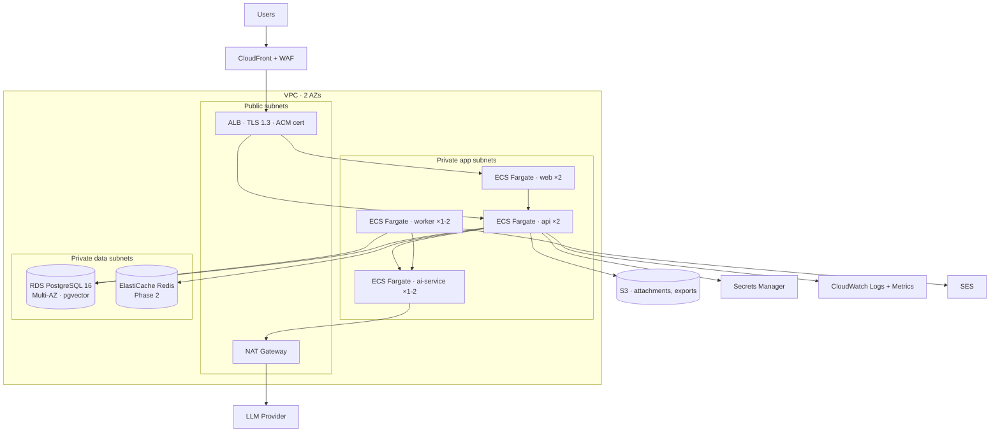
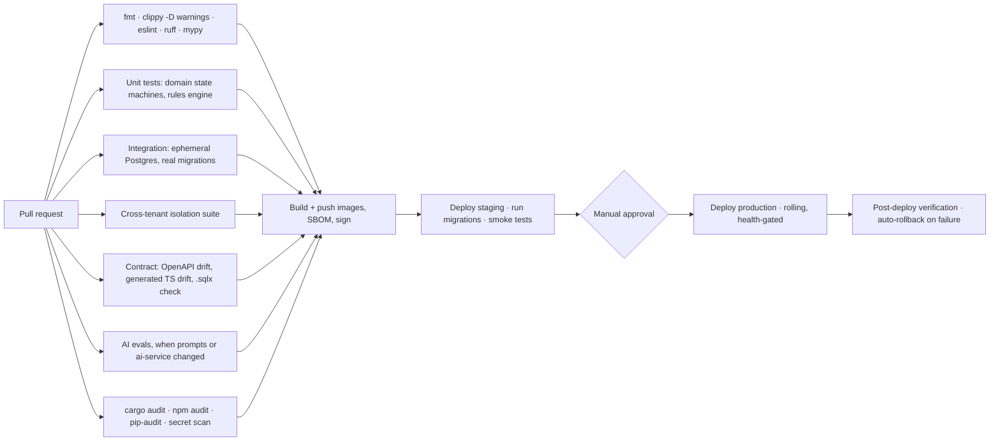

# 09 — Deployment & Operations

## 9.1 Repository layout

A single repository. Three deployables, one schema, one place to change a contract and
everything it touches.

```
MESSI/
├── docs/                     this design set
├── backend/                  Rust workspace
│   ├── crates/{domain,app,infra,api,worker,contracts}
│   ├── migrations/           sqlx SQL migrations
│   └── .sqlx/                offline query metadata (checked in)
├── ai-service/               Python / FastAPI + evals
├── web/                      Next.js app
├── packages/api-client/      TypeScript client generated from OpenAPI
├── deploy/
│   ├── terraform/            AWS infrastructure as code
│   └── docker/               Dockerfiles, compose for local
└── .github/workflows/        CI/CD
```

## 9.2 Local development

```bash
make dev      # postgres + minio + backend + worker + ai-service + web, hot reload
make migrate  # apply migrations
make seed     # one org, roles, two screening templates, a demo project with issues
make test     # unit + integration + cross-tenant suite
make check    # fmt, clippy -D warnings, sqlx offline check, openapi drift, type drift
```

`docker compose` brings up Postgres 16 with `pgvector`, MinIO for S3, Mailpit for email,
and the three services. The AI service defaults to the **replay provider** — offline,
free, deterministic. A developer opts into live model calls with `AI_PROVIDER=live`.

Onboarding target: clone → `make dev` → working seeded system in under 10 minutes. Anything
slower and developers build workarounds instead of using the environment.

## 9.3 Containers

| Image | Base | Notes |
|---|---|---|
| `messi-api` | `rust:1-slim` builder → `gcr.io/distroless/cc` | Static-ish binary, non-root, ~30 MB, no shell |
| `messi-worker` | same builder, same binary | Different entrypoint; one build, two roles |
| `messi-ai` | `python:3.12-slim` | `uv` for dependency resolution, non-root |
| `messi-web` | `node:22-alpine` builder → Next.js standalone output | Non-root |

All images: multi-stage, pinned base digests, `HEALTHCHECK`, read-only root filesystem,
dropped Linux capabilities, no secrets baked in.

## 9.4 AWS topology



**Sizing for the pilot:** api 2 × (0.5 vCPU / 1 GB), worker 1 × (0.5 / 1), ai-service 1 ×
(0.5 / 1), web 2 × (0.25 / 0.5), RDS `db.t4g.small` Multi-AZ with 50 GB gp3. Deliberately
small; autoscaling policies exist and are tested, but the pilot should not pay for capacity
it cannot use.

**Network posture:** only the ALB is internet-reachable. The AI service has no ingress rule
from the internet and no public route; its egress to the provider goes through the NAT
gateway. Security groups reference each other by group id, not CIDR — an added task
inherits the correct posture automatically.

## 9.5 CI/CD



**Deployment rules**

- Migrations run as a separate ECS task **before** the new service revision, and must be
  backward compatible with the currently running version (expand/contract, [doc 04](04-data-model.md) §4.13).
  This is what makes rolling deploys and instant rollback safe.
- Rolling update with health-gated replacement; ALB drains connections; rollback is
  redeploying the previous task definition, which is always still compatible with the
  current schema.
- Feature flags gate incomplete work so `main` is always deployable. Every Phase 2 AI
  feature ships behind a flag and is enabled per organization.
- Trunk-based development; short-lived branches; every merge to `main` reaches staging
  automatically.

## 9.6 Observability

**Tracing.** OpenTelemetry end to end. A single trace covers: browser interaction → Next.js
server action → Core API handler → database queries → outbox write → worker pickup →
AI service call → provider call. `request_id` propagates through every log line and is
returned in every error body, so a user-reported problem is one search.

**Metrics** (RED for services, plus domain-specific):

| Category | Metrics |
|---|---|
| API | Request rate, error rate, latency p50/p95/p99 by route |
| Database | Connection pool saturation, slow queries > 200 ms, replication lag, deadlocks |
| Queue | Outbox lag, job queue depth, job latency, failure rate, dead-letter count |
| AI | Job rate by task, latency, cost per hour, cache hit rate, schema-validation failure rate, budget utilization |
| Business | Screenings submitted/converted, issues opened/closed, projects by health, MAU/WAU, edit-free AI acceptance rate |

The business row belongs in the same system as the technical rows: it is the KPI
instrumentation from [doc 10](10-delivery-plan-and-kpis.md), and if it lives in a separate
spreadsheet it will not survive the pilot.

**Logging.** Structured JSON to CloudWatch, PII-scrubbed by allow-list, 30-day hot / 1-year
archived to S3.

**Alerting** (paging vs. ticketing distinguished, because alerts that always page are alerts
people mute):

| Page immediately | Ticket next business day |
|---|---|
| API 5xx rate > 2% for 5 min | AI provider error rate > 10% |
| API p95 > 2 s for 10 min | Cost anomaly > 150% of 7-day mean |
| Database unreachable or CPU > 85% for 10 min | Dead-letter count > 0 |
| Outbox lag > 15 min | Disk > 75% |
| Health checks failing on ≥ half of tasks | AI budget at 80% |

## 9.7 Runbooks

Short, specific, kept next to the code they describe (`docs/runbooks/`), written before the
incident rather than during it.

| Scenario | First action |
|---|---|
| AI provider outage | Confirm via `/internal/health`; jobs retry automatically; if > 30 min, disable AI per org — the platform continues without it |
| Outbox lag climbing | Check worker task count and DB CPU; scale workers; inspect the poison message at the head |
| Runaway automation rule | `PATCH /v1/automation/rules/{id}` `enabled=false`; the per-rule fire budget should already have tripped |
| AI cost spike | `GET /v1/ai/usage?group_by=task_type`; lower the org budget; check cache hit rate for a prompt-version change that invalidated the cache |
| Bad deploy | Redeploy previous task definition; schema is backward compatible by rule |
| Data corruption | PITR restore to a parallel instance, verify, then cut over |
| Suspected credential compromise | Revoke session family, rotate secret, review `events` for the actor, notify owners |

## 9.8 Cost envelope (pilot)

| Item | Monthly, order of magnitude |
|---|---|
| ECS Fargate (6 small tasks) | ~$90 |
| RDS `db.t4g.small` Multi-AZ + storage | ~$110 |
| ALB + CloudFront + NAT | ~$70 |
| S3 + CloudWatch + Secrets Manager | ~$25 |
| LLM provider | ≤ $200 (budget-enforced, [doc 06](06-ai-layer.md) §6.4) |
| **Total** | **≈ $500 / month** |

Single-AZ RDS in the earliest pilot weeks removes roughly $50 and is a defensible trade
while there are no external users; the Terraform variable exists for it.

## 9.9 Disaster recovery

| Scenario | RPO | RTO | Mechanism |
|---|---|---|---|
| Task failure | 0 | < 1 min | ECS reschedules |
| AZ failure | 0 | < 5 min | Multi-AZ RDS failover, tasks in 2 AZs |
| Accidental data deletion | ≤ 5 min | < 2 h | PITR restore |
| Region failure | ≤ 24 h | < 8 h | Cross-region snapshot copies, Terraform rebuild |

Restore is exercised quarterly against staging. A backup that has never been restored is a
hypothesis, not a backup.
