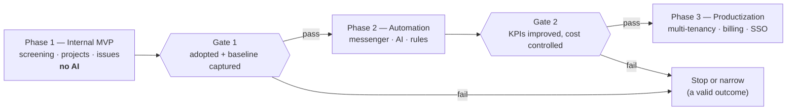

# 10 — Delivery Plan & KPIs

The programme overview: how the phases relate, what is measured across all of them, and
what must be decided before work starts. Each phase has its own document, so it can be
scoped, reviewed and approved on its own:

| Phase | Document | Gate |
|---|---|---|
| 1 | [Internal MVP](11-phase-1-mvp.md) | Baseline captured, workflows adopted |
| 2 | [Automation](12-phase-2-automation.md) | AI measurably beats the baseline, at controlled cost |
| 3 | [Productization](13-phase-3-productization.md) | Only entered if Phase 2 passed |

## 10.1 Principle

> "Success should be measured by operational improvement, not by the amount of AI used."
> — proposal, slide 7

Every KPI below has a named table or metric behind it, and the **baseline is captured
before the feature that is meant to improve it ships**. A KPI whose measurement starts
after the intervention cannot demonstrate anything.

This is the reason Phase 1 contains no model calls at all. It is not caution about AI; it
is the only way Phase 2 can be evaluated.

## 10.2 How the phases relate

Two properties of this structure are deliberate:

1. **No phase is a prerequisite for an earlier one.** Nothing in Phase 1 is built "so that
   Phase 3 works", except decisions that cost nothing today — `organization_id` columns,
   RLS, data-driven automation rules. Those are recorded as ADRs precisely because they are
   the exceptions.
2. **"Stop" is a real outcome at both gates.** A Phase 1 that proves the workflow chain but
   shows AI is not worth it has produced a useful, cheap internal tool and a real finding.
   Treating that as failure is how organizations end up shipping Phase 2 regardless of what
   Phase 1 showed.

## 10.3 The KPI scorecard

Six KPIs, mapped to the proposal's three value themes. Each has a definition precise
enough that two people compute the same number.

### Reduce manual work

| KPI | Definition | Source | Target |
|---|---|---|---|
| **Screening processing time** | Median hours from `screenings.submitted_at` to `decided_at`, business hours only | `screenings` | −40% by end of Phase 2 |
| **Duplicate data entry** | Share of project/customer fields populated by conversion or accepted extraction rather than typed | `screening_answers.origin`, `projects.source_id`, `ai_feedback` | ≥ 60% auto-populated |

### Improve visibility

| KPI | Definition | Source | Target |
|---|---|---|---|
| **Project status reporting time** | Median minutes spent producing the weekly status report (timed exercise, 5 projects, same reporter, monthly) | Manual measurement protocol | −70% |
| **Issue ownership** | Share of issues in `in_progress`/`blocked`/`in_review` with an assignee | `issues` | 100% (structurally enforced, so this measures rule integrity) |

### Improve response

| KPI | Definition | Source | Target |
|---|---|---|---|
| **Issue resolution time** | Median business hours from first `open` transition to `done` | `issue_transitions` | −25% |
| **Overdue issues** | Count of open issues past `due_at`, sampled daily | `issues` daily rollup | −50% |

### Adoption and cost, tracked alongside

| Metric | Definition |
|---|---|
| Weekly active users | Distinct users with ≥ 1 state-changing event in the week |
| Records created per active user per week | Screenings + issues + comments |
| Edit-free AI acceptance rate | `ai_feedback.disposition='accepted'` ÷ all dispositions, by task type |
| AI cost per screening / per project per month | `ai_jobs.cost_micros` ÷ volume |

### Which phase owns which number

| KPI | Baseline set in | Improvement expected from |
|---|---|---|
| Screening processing time | Phase 1 | Phase 2 (extraction, classification) |
| Duplicate data entry | Phase 1 (conversion alone) | Phase 2 (extraction raises it further) |
| Project status reporting time | Phase 1 | Phase 1 (dashboard) then Phase 2 (narrative) |
| Issue ownership | Phase 1 | Phase 1 — structurally enforced from day one |
| Issue resolution time | Phase 1 | Phase 2 (escalation rules, notifications) |
| Overdue issues | Phase 1 | Phase 2 (automation) |

Two of the six are expected to improve in Phase 1 alone. That matters: it means Phase 1 has
to justify itself on its own numbers rather than as setup for the interesting part.

## 10.4 Measurement mechanics

- `kpi.rollup` runs nightly, materializing per-day values into `kpi_daily` so a dashboard
  query is a range scan, not a recomputation over `issue_transitions`.
- Business-hours arithmetic uses the organization's calendar from
  `organizations.settings` — a blocker opened Friday 17:00 and resolved Monday 09:00 is
  two business hours, not sixty-four. Reporting elapsed clock time would make every
  weekend look like a crisis.
- KPI definitions are versioned. If a definition changes, the chart shows the change point
  rather than silently rewriting history.
- Two KPIs (reporting time, and the qualitative exit criteria) are **manual measurements by
  protocol**. Pretending everything is automatable produces either a bad proxy metric or a
  missing one; a documented monthly 20-minute exercise is more honest and more useful.
- The KPI endpoint (`GET /v1/insights/kpis`) ships in Phase 1, not alongside the features
  it evaluates. Instrumentation added later measures only what happened after it arrived.

## 10.5 Risk register

The proposal's three risks, plus what this design actually does about them. Phase-specific
risks live in the phase documents.

| Risk | Control in this design |
|---|---|
| **Scope creep** | Non-goals written down ([doc 01](01-overview.md) §1.5); phase exit criteria are gates, not suggestions; nothing from a later phase is a prerequisite for an earlier one |
| **AI cost** | Budget ceiling enforced pre-dispatch; content-addressed caching; model tiering; debouncing; per-task cost visible on a dashboard from the first AI feature |
| **Adoption** | Phase 1 delivers value with no AI, so adoption is not contingent on model quality; conversion flows remove re-entry immediately; the four-step AI rollout in [Phase 2](12-phase-2-automation.md) means users never meet an unreliable feature presented as reliable |
| *(added)* **AI quality is unmeasurable** | `ai_feedback` captured at the point of use; golden-set evals gate every prompt change; edit-free acceptance is a named KPI |
| *(added)* **Health metrics become distrusted** | Deterministic metrics separated from AI narrative; `triggered_rule` recorded so every badge is explainable; thresholds configurable per organization ([ADR-0006](adr/0006-deterministic-health-ai-narrative.md)) |
| *(added)* **Automation misfires** | Dry-run against 30 days of history, per-rule fire budget, cascade-hop limit, automation-origin marking |
| *(added)* **Key-person dependency** | One repository, `make dev` under 10 minutes, ADRs recording why, runbooks written before incidents |

## 10.6 First decisions needed

To start Phase 1, three inputs are required from the business — none of them technical:

1. **Which two Lightrees workflows** are the pilot? The screening templates and the field
   mappings are built for these specifically.
2. **Who are the 10–15 pilot users**, and which of them are managers? Role assignment and
   the dashboard's default view depend on it.
3. **What are today's numbers** for the six KPIs, even roughly? If a pre-system baseline
   cannot be reconstructed, the first four weeks of Phase 1 become the baseline period —
   which is acceptable, but it must be a decision rather than a discovery.

The proposal's recommended next step — "approve a small internal MVP focused on Screening +
Projects + Issues" — is exactly [Phase 1](11-phase-1-mvp.md).
