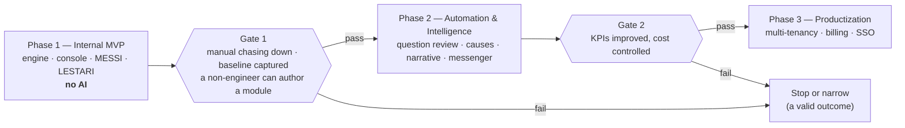

# 10 — Delivery Plan & KPIs

The programme overview: how the phases relate, what is measured across all of them, and
what must be decided before work starts. Each phase has its own document, so it can be
scoped, reviewed and approved on its own:

| Phase | Document | Gate |
|---|---|---|
| 1 | [Internal MVP](11-phase-1-mvp.md) | Baseline captured, workflows adopted |
| 2 | [Automation & Intelligence](12-phase-2-automation.md) | AI measurably beats the baseline, at controlled cost |
| 3 | [Productization](13-phase-3-productization.md) | Only entered if Phase 2 passed |

## 10.1 Principle

> "Success should be measured by operational improvement, not by the amount of AI used."
> — proposal, slide 7

Every KPI below has a named table or metric behind it, and the **baseline is captured
before the feature that is meant to improve it ships**. A KPI whose measurement starts
after the intervention cannot demonstrate anything.

This is the reason Phase 1 contains no model calls at all. It is not caution about AI; it
is the only way Phase 2 can be evaluated.

## 10.2 How the phases relate

Two properties of this structure are deliberate:

1. **No phase is a prerequisite for an earlier one.** Nothing in Phase 1 is built "so that
   Phase 3 works", except decisions that cost nothing today — `organization_id` columns,
   RLS, data-driven modules and automation rules. Those are recorded as ADRs precisely
   because they are the exceptions.

   The authoring console is the one thing that looks like Phase 3 work sitting in Phase 1,
   and it is not: without it there is no engine, only two hard-coded forms
   ([doc 11](11-phase-1-mvp.md) §11.2).
2. **"Stop" is a real outcome at both gates.** A Phase 1 that proves the workflow chain but
   shows AI is not worth it has produced a useful, cheap internal tool and a real finding.
   Treating that as failure is how organizations end up shipping Phase 2 regardless of what
   Phase 1 showed.

## 10.3 The KPI scorecard

Mapped to the proposal's three value themes, but reordered around what the product actually
is: a machine that removes manual follow-up. Each definition is precise enough that two
people compute the same number.

### The first-order question

One KPI decides whether this was worth building. It is measured by protocol, not by the
system, because the system cannot see what happens outside it.

| KPI | Definition | Source | Target |
|---|---|---|---|
| **Manual chase count** | Ad-hoc follow-ups a leader initiates outside MESSI in a week — asking in chat, in person, in a meeting. Tallied by the leader daily, reported weekly. | Manual protocol | −80% by end of Phase 2 |

If cycle response rate is 95% and the leader is still chasing people in WhatsApp all day, the
system has added work rather than replaced it. Every other number below can look healthy
while this one says the product failed. It is measured from **week one of Phase 1**, before
the engine is switched on, so the baseline is real.

### Reduce manual work

| KPI | Definition | Source | Target |
|---|---|---|---|
| **Commitment-kept rate** | Commitments resolved `kept` by their due date ÷ commitments made | `commitments` | ≥ 75%, +20pp on baseline |
| **Duplicate data entry** | Share of downstream object fields populated by conversion or pre-fill rather than typed | `followup_answers.origin`, `followup_outcomes` | ≥ 60% auto-populated |

### Improve visibility

| KPI | Definition | Source | Target |
|---|---|---|---|
| **Stalled subjects detected by the system** | Subjects past p90 time-in-stage surfaced automatically ÷ all stalls found by any means | `subject_stage_history` | ≥ 90% found by the system, not by someone noticing |
| **Status reporting time** | Median minutes to produce the weekly status report (timed exercise, same reporter, monthly) | Manual protocol | −70% |

### Improve response

| KPI | Definition | Source | Target |
|---|---|---|---|
| **Issue resolution time** | Median business hours from first `open` transition to `done` | `issue_transitions` | −25% |
| **Overdue issues** | Open issues past `due_at`, sampled daily | `issues` daily rollup | −50% |

### Guard metrics

These do not measure success. They detect the specific ways this product dies, and a
regression in either invalidates everything above it.

| Metric | Definition | Alarm |
|---|---|---|
| **Cycle response rate** | Cycles `submitted` or `late` ÷ generated | Below 80% — the cadence is wrong before the people are |
| **Answer staleness** | Cycles whose free-text answer is near-identical to the previous one | Above 30% — the ritual has gone hollow ([doc 17](17-answer-analysis.md) §17.7) |

Answer staleness is the earlier of the two warnings. Response rate stays high while quality
collapses — which is exactly what happened to the Telegram reports
([doc 16](16-question-design.md) §16.1).

### Adoption and cost, tracked alongside

| Metric | Definition |
|---|---|
| Weekly active players | Distinct users submitting ≥ 1 cycle in the week |
| Modules in active use | Published modules with ≥ 1 cycle submitted in the week |
| Edit-free AI acceptance rate | `ai_feedback.disposition='accepted'` ÷ all dispositions, by task |
| Question-review acceptance | `question_reviews.disposition` — whether authors act on AI rewrites |
| AI cost per active player per month | `ai_jobs.cost_micros` ÷ active players |

### Which phase owns which number

| KPI | Baseline set in | Improvement expected from |
|---|---|---|
| Manual chase count | **Before Phase 1 ships** — week one, by protocol | Phase 1 (the engine itself), then Phase 2 |
| Commitment-kept rate | Phase 1, once cycles run | Phase 1 — commitment cadence is a Phase 1 feature |
| Duplicate data entry | Phase 1 (pre-fill and conversion) | Phase 2 (extraction raises it further) |
| Stalled subjects detected | Phase 1 | Phase 1 — stage tracking is deterministic |
| Status reporting time | Phase 1 | Phase 1 (dashboard), then Phase 2 (narrative) |
| Issue resolution time | Phase 1 | Phase 2 (escalation rules, notifications) |
| Overdue issues | Phase 1 | Phase 2 (automation) |

**Four of the seven are expected to improve in Phase 1 alone, with no AI involved.** That is
deliberate and it is the strongest argument for the phasing: the follow-up engine has to
justify itself on its own numbers. If removing the manual chasing does not by itself move
commitment-kept rate and stall detection, adding a model on top will not rescue it.

## 10.4 Measurement mechanics

- `kpi.rollup` runs nightly, materializing per-day values into `kpi_daily` so a dashboard
  query is a range scan, not a recomputation over `issue_transitions`.
- Business-hours arithmetic uses the organization's calendar from
  `organizations.settings` — a blocker opened Friday 17:00 and resolved Monday 09:00 is
  two business hours, not sixty-four. Reporting elapsed clock time would make every
  weekend look like a crisis.
- KPI definitions are versioned. If a definition changes, the chart shows the change point
  rather than silently rewriting history.
- Two KPIs (reporting time, and the qualitative exit criteria) are **manual measurements by
  protocol**. Pretending everything is automatable produces either a bad proxy metric or a
  missing one; a documented monthly 20-minute exercise is more honest and more useful.
- The KPI endpoint (`GET /v1/insights/kpis`) ships in Phase 1, not alongside the features
  it evaluates. Instrumentation added later measures only what happened after it arrived.

## 10.5 Risk register

The proposal's three risks, plus what this design actually does about them. Phase-specific
risks live in the phase documents.

| Risk | Control in this design |
|---|---|
| **Scope creep** | Non-goals written down ([doc 01](01-overview.md) §1.5); phase exit criteria are gates, not suggestions; nothing from a later phase is a prerequisite for an earlier one |
| **AI cost** | Budget ceiling enforced pre-dispatch; content-addressed caching; model tiering; debouncing; per-task cost visible on a dashboard from the first AI feature |
| **Adoption** | Phase 1 delivers value with no AI, so adoption is not contingent on model quality; conversion flows remove re-entry immediately; the four-step AI rollout in [Phase 2](12-phase-2-automation.md) means users never meet an unreliable feature presented as reliable |
| *(added)* **AI quality is unmeasurable** | `ai_feedback` captured at the point of use; golden-set evals gate every prompt change; edit-free acceptance is a named KPI |
| *(added)* **Health metrics become distrusted** | Deterministic metrics separated from AI narrative; `triggered_rule` recorded so every badge is explainable; thresholds configurable per organization ([ADR-0006](adr/0006-deterministic-health-ai-narrative.md)) |
| *(added)* **Automation misfires** | Dry-run against 30 days of history, per-rule fire budget, cascade-hop limit, automation-origin marking |
| *(added)* **Key-person dependency** | One repository, `make dev` under 10 minutes, ADRs recording why, runbooks written before incidents |

## 10.6 First decisions needed

To start Phase 1, four inputs are required from the business — none of them technical:

1. **Which two follow-up programs** are the pilot? MESSI and LESTARI are the recommendation
   ([doc 11](11-phase-1-mvp.md) §11.5); the questions inside them are built for the specific
   work being followed up.
2. **Who are the 10–15 players**, and who is the pilot leader? Role assignment, enrolment and
   the dashboard's default view depend on it — and the leader carries the week-one obligation
   to visibly act on answers ([doc 16](16-question-design.md) §16.1).
3. **The manual chase baseline** — the pilot leader starts tallying ad-hoc follow-ups two
   weeks before any code ships. This needs no software and cannot be reconstructed later; it
   is the one number that says whether the product did what it exists to do.
4. **Today's numbers** for the operational KPIs, even roughly. If a pre-system baseline
   cannot be reconstructed, the first four weeks of Phase 1 become the baseline period —
   acceptable, but it must be a decision rather than a discovery.

The proposal's recommended next step was "approve a small internal MVP focused on Screening +
Projects + Issues". With screening now understood as *messenger screening* — one module of a
follow-up engine ([ADR-0007](adr/0007-followup-cycles-generalize-screening.md)) — the
equivalent step is to approve [Phase 1](11-phase-1-mvp.md): the engine, its authoring console,
and two real follow-up programs running on it.
