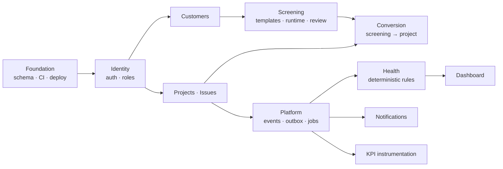

# 11 — Phase 1: Internal MVP

> Proposal, slide 8: *Screening · Projects · Tasks & issues · Basic dashboard · User / role management*

**Goal:** the screening → project → issue chain works, is adopted by real Lightrees
workflows, and produces the KPI baseline that every later phase is judged against.

**Defining constraint:** no model calls anywhere on a user path. The AI service is built,
deployed and health-checked, but nothing calls it. See §11.3 for why.

## 11.1 Scope

| Workstream | Deliverable |
|---|---|
| Foundation | Repo, CI, Terraform for staging, Postgres schema, migrations, seed data |
| Identity | Login, MFA, sessions, roles, memberships, invitations, audit log |
| Customers | Customer + contact CRUD, timeline view |
| Screening | Template builder (versioned), form runtime, submission, review queue, deterministic scoring, accept/reject |
| Conversion | Screening → project, with declarative field mapping and provenance |
| Projects | CRUD, membership, milestones, lifecycle transitions |
| Issues | CRUD, board, transitions with ownership enforcement, comments, links, transition audit |
| Health (deterministic) | Snapshot job, rule evaluation, health badge, progress % |
| Dashboard | Portfolio view, my-work view, screening queue |
| Platform | Events, outbox, job runner, notifications (in-app + email) |
| Instrumentation | KPI aggregation job and `GET /v1/insights/kpis` |

## 11.2 Sequencing

Ordered by what unblocks what, not by importance.

Two ordering decisions worth stating:

- **Projects and issues before screening.** Screening's value is realised at conversion,
  and conversion needs a target. Building screening first produces a form tool with nowhere
  to send its output.
- **KPI instrumentation is not last.** It depends only on the platform layer, and it must
  be live for the whole baseline period. Scheduling it at the end of the phase would leave
  the baseline measuring the final two weeks instead of the phase.

## 11.3 Why no AI in this phase

Three independent reasons, any one of which would be sufficient:

1. **Measurement.** Phase 2 claims AI improves operations. That claim is unfalsifiable
   without a pre-AI baseline drawn from the same system, the same users and the same
   workflows.
2. **Adoption risk.** The proposal names adoption as a risk. If users' first encounter with
   MESSI is a half-tuned classifier, they attribute the tool's quality to the model's
   quality. Phase 1 earns trust with deterministic behaviour first.
3. **Scope discipline.** AI work expands to fill available time. Excluding it entirely from
   Phase 1 removes the negotiation.

The AI service is nonetheless built and deployed in this phase — scaffolded, containerised,
health-checked, wired into CI with its evaluation harness and replay provider. Standing up
a new service under time pressure in Phase 2 is the avoidable version of this problem.

## 11.4 Not in this phase

| Excluded | Where it lands |
|---|---|
| Any model call on a user path | [Phase 2](12-phase-2-automation.md) |
| Messenger, conversations, email ingestion | Phase 2 |
| Automation rules engine | Phase 2 |
| Slack / Teams | Phase 2 |
| Multi-tenancy UI, billing, SSO | [Phase 3](13-phase-3-productization.md) |
| Public API, webhooks | Phase 3 |

Note what is *not* deferred: `organization_id` on every table, composite foreign keys and
row-level security are all active from the first migration
([ADR-0002](adr/0002-org-scoped-single-database-multitenancy.md)). They cost nothing now
and are the reason Phase 3 is cheap.

## 11.5 Exit criteria

| # | Criterion | How it is checked |
|---|---|---|
| 1 | Two real Lightrees workflows run end-to-end in production for four consecutive weeks | Production data, not a demo |
| 2 | ≥ 80% of pilot users active weekly | Weekly active users metric |
| 3 | Zero known cross-tenant or authorization defects | Isolation suite green on every PR; no open findings |
| 4 | Baselines captured for all six KPIs, with ≥ 30 completed screenings and ≥ 100 closed issues | `GET /v1/insights/kpis` over the baseline window |
| 5 | p95 API latency within [doc 01](01-overview.md) §1.6 targets | Observability dashboards |
| 6 | Users report the chain removes re-entry | Structured post-pilot interview, not a vibe |

**Criterion 4 is the gate that matters.** The volume thresholds exist because a median
computed over eight screenings is not a baseline, it is an anecdote. If volume is short at
the four-week mark, the correct response is to extend the baseline window — not to proceed
with a weak number that will be used for a year.

## 11.6 Phase-specific risks

| Risk | Signal | Response |
|---|---|---|
| Pilot workflows chosen badly (too rare to generate volume, or too simple to be representative) | Criterion 4 volume tracking behind at week 2 | Add a third workflow rather than extending indefinitely; this is why the decision is made up front (§10.6) |
| Screening template churn during the baseline | Frequent new template versions | Templates are versioned and KPIs are computed per template version, so churn is visible rather than silently corrupting the baseline |
| Users work around the tool (spreadsheets alongside) | Adoption metric fine, but records thin | Covered by criterion 6's interview; a tool that is logged into but not used passes criterion 2 and fails the phase |
| Health rules mis-tuned, badges distrusted early | Managers ignore the badge | Thresholds are configuration, not code; tune during the phase using `triggered_rule` distribution |

## 11.7 What this phase needs to start

The three business inputs in [doc 10](10-delivery-plan.md) §10.6 — the two pilot
workflows, the pilot user list with roles, and whatever baseline numbers can be
reconstructed today. Nothing else is blocking.
