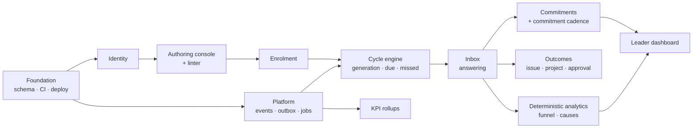

# 11 — Phase 1: Internal MVP

**Goal:** the follow-up engine works, two real Lightrees follow-up programs run on it daily,
the manual chasing measurably stops, and the KPI baseline exists.

**Defining constraint:** no model calls anywhere on a user path. See §11.3.

**What Phase 1 is not:** a screening tool, a project tool, or an issue tracker. Projects and
issues exist in Phase 1 only as far as they are needed to be *outcomes* of a follow-up
answer. The engine is the product ([ADR-0007](adr/0007-followup-cycles-generalize-screening.md)).

## 11.1 Scope

| Workstream | Deliverable |
|---|---|
| Foundation | Repo, CI, Terraform for staging, Postgres schema, migrations, seed data |
| Identity | Login, MFA, sessions, roles, memberships, invitations, audit log |
| **Authoring console** | Module builder, question types, **deterministic linter**, blueprints, preview, 30-day dry run, versioning |
| **Enrolment** | Player × subject × cadence, bulk enrol, pause/resume, per-subject cadence override |
| **Cycle engine** | Scheduled generation, `period_key` idempotency, due/grace, missed reaper, snooze |
| **Commitments** | Extraction from answers, commitment-driven cadence, kept/broken resolution, escalation |
| **Inbox** | Player surface: overdue commitments, cycles due, requests, later this week |
| **Answers** | Typed answers, checklist and thread-list types, `stage`, `cause_code`, conditionals, pre-fill |
| **Outcomes** | Convert an answer into an issue, a project, or an approval request |
| Subjects | Customers/leads and projects as followable subjects; contacts |
| Projects & issues | Enough to be outcome targets: CRUD, assignment, transitions with ownership enforcement, comments |
| **Leader dashboard** | Exception-based: missed cycles, broken commitments, stalls, staleness flags |
| **Deterministic analytics** | Stage funnel, time-in-stage, stall detection, cause aggregation, concentration vs systemic |
| Platform | Events, outbox, job runner, notifications (in-app + email) |
| Instrumentation | Nightly KPI rollups and `GET /v1/insights/kpis` |

Bold rows are new to Phase 1 relative to the original plan, and are the product's core.

## 11.2 Sequencing

Three ordering decisions worth stating:

- **The authoring console comes before anything is asked of anyone.** It is the product. It
  is also the thing most likely to be deferred under pressure — "we'll hard-code MESSI and
  LESTARI for now, build the builder later" — which would produce two bespoke forms and no
  product. If the console slips, the phase slips.
- **Commitments come after the inbox, not with it.** Cycles must be answerable on a plain
  calendar cadence first; commitment-driven cadence is layered on once real answers exist to
  drive it. This keeps the riskiest scheduling logic off the critical path to first use.
- **KPI instrumentation is early, not last.** It must be live for the whole baseline period.
  Built at the end, it measures the final fortnight instead of the phase.

## 11.3 Why no AI in this phase

Unchanged in substance, but the reasoning is now stronger:

1. **Measurement.** Phase 2 claims AI improves operations. Unfalsifiable without a pre-AI
   baseline from the same system, users and workflows.
2. **Adoption.** If the team's first encounter with MESSI is a half-tuned model, they judge
   the tool by the model. The engine earns trust with deterministic behaviour first.
3. **Scope discipline.** AI work expands to fill available time.
4. **The engine must work without it.** Every management question in
   [doc 17](17-answer-analysis.md) — progress, bottleneck, concentration vs systemic — is
   answered by arithmetic ([ADR-0009](adr/0009-attribution-computed-narrative-written.md)).
   If those views are not useful in Phase 1 without narrative text, adding narrative text
   will not make them useful.

**The five tests are applied by hand in Phase 1.** The deterministic linter ships; the AI
question reviewer does not. Authors work through the tests in
[doc 16](16-question-design.md) §16.2 as a checklist in the console. This is deliberate — it
teaches the authors the standard before a model starts proposing rewrites, and it produces
the labelled examples the Phase 2 reviewer is evaluated against.

The AI service is still built and deployed this phase: containerised, health-checked, wired
into CI with its evaluation harness and replay provider. Standing up a new service under
pressure in Phase 2 is the avoidable version of this problem.

## 11.4 Not in this phase

| Excluded | Where it lands |
|---|---|
| Any model call on a user path | [Phase 2](12-phase-2-automation.md) |
| AI question review | Phase 2 — first feature |
| Messenger integration; MESSI counts are self-reported | Phase 2 ([doc 15](15-modules-and-outcomes.md) §15.1) |
| SHERINA scheduling, signature requests | Phase 2 |
| Automation rules engine | Phase 2 |
| Scoring and job goals | Phase 2 — off for the first month regardless ([doc 14](14-followup-engine.md) §14.9) |
| Theme mining, narratives | Phase 2 |
| Multi-tenancy UI, billing, SSO | [Phase 3](13-phase-3-productization.md) |

Not deferred: `organization_id` everywhere, composite foreign keys and row-level security,
all active from the first migration
([ADR-0002](adr/0002-org-scoped-single-database-multitenancy.md)).

## 11.5 Launch modules

Two, not four ([doc 16](16-question-design.md) §16.9):

| Module | Subject | Cadence | Why first |
|---|---|---|---|
| **MESSI** | self | Daily, weekdays | Everyone participates; exercises checklists, thread lists and all outcome types |
| **LESTARI** | lead | Commitment-driven, weekly fallback | Exercises commitments, stages and cause codes — the analytical core |

PRISTA and SHERINA are designed and can be authored in the console, but are not enrolled
during Phase 1. Adding a module is a console action, so this costs nothing to defer and
protects the baseline from too many moving parts.

## 11.6 Exit criteria

| # | Criterion | How it is checked |
|---|---|---|
| 1 | MESSI and LESTARI run in production for four consecutive weeks | Production data, not a demo |
| 2 | Cycle response rate ≥ 80%, answer staleness ≤ 30% | Guard metrics, [doc 10](10-delivery-plan.md) §10.3 |
| 3 | **Manual chase count down ≥ 50% against the pre-launch baseline** | Leader's weekly tally |
| 4 | Baselines captured for all seven KPIs, with ≥ 200 submitted cycles and ≥ 100 commitments | `GET /v1/insights/kpis` |
| 5 | A non-engineer authors and publishes a working third module unaided | Observed; the console is the product |
| 6 | Zero known cross-tenant or authorization defects | Isolation suite green; no open findings |
| 7 | p95 API latency within [doc 01](01-overview.md) §1.6 targets | Observability dashboards |

**Criteria 3 and 5 are the ones that matter.** Criterion 3 is the only evidence the manual
asking actually stopped. Criterion 5 is the only evidence this is a product rather than two
hard-coded forms — and it should be tested with someone outside the project, given a real
follow-up need of their own.

Criterion 4's volume thresholds exist because a commitment-kept rate over eleven commitments
is an anecdote. If volume is short at four weeks, extend the baseline window rather than
proceed on a weak number that will be quoted for a year.

## 11.7 Phase-specific risks

| Risk | Signal | Response |
|---|---|---|
| Console deferred under delivery pressure | "Let's hard-code the two modules for now" | Criterion 5 is an exit gate. Two bespoke forms are not this product. |
| Questions authored badly despite the linter | Answer staleness climbing in week 2–3 | Rewrite the module, do not chase the players ([ADR-0010](adr/0010-question-quality-gated-at-authoring.md)) |
| Cadence too aggressive at launch | Response rate falling while enrolments grow | Per-subject cadence and decay exist from day one — use them ([doc 14](14-followup-engine.md) §14.8) |
| Leader does not visibly act on answers | Response rate decays with no other cause | Failure mode 1 ([doc 16](16-question-design.md) §16.1). Decided in week one; make it an explicit expectation of the pilot leader. |
| Projects/issues scope creeps into a full tracker | Backlog filling with board features | They are outcome targets in Phase 1. Anything beyond that is Phase 2 at the earliest. |
| Baseline not captured before launch | No pre-launch chase count exists | Start the leader's tally two weeks before first enrolment — it needs no software |

## 11.8 What this phase needs to start

1. **Which two follow-up programs** are the pilot — confirmed as MESSI and LESTARI, with the
   actual questions drafted and run through the five tests.
2. **Who the 10–15 players are**, and who the pilot leader is.
3. **The pre-launch manual chase baseline** — the leader's tally, started before any code
   ships. This costs nothing and cannot be reconstructed later.
4. **The existing Telegram report format**, to be rewritten through the five tests
   ([doc 16](16-question-design.md) §16.9). An afternoon's work, no code required, and it
   surfaces which current daily questions were never worth asking.
