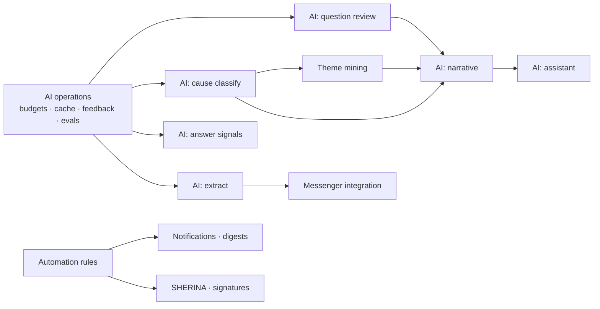

# 12 — Phase 2: Automation & Intelligence

**Goal:** AI and automation measurably improve the [Phase 1](11-phase-1-mvp.md) baseline, at
a cost that is known and bounded.

**Entry condition:** all seven Phase 1 exit criteria met. Criteria 3 (manual chase count down
≥ 50%) and 4 (baselines at volume) are non-negotiable — without them this phase has nothing
to prove and nothing to prove it against.

## 12.1 Scope

| Workstream | Deliverable |
|---|---|
| **AI operations** | Budgets, caching, cost dashboard, `ai_feedback` capture, eval suite in CI |
| **AI: question review** | Five-test evaluation with suggested rewrites, in the console |
| AI: cause classify | Free-text detail → proposed `cause_code`, confidence-gated auto-apply |
| AI: theme mining | Embedding clusters over free text → proposed new cause codes |
| AI: answer signals | Responsiveness nudge at submit time; staleness already computed |
| AI: narrative | `ops_narrative` over computed findings; project health narrative |
| AI: assistant | Retrieval-grounded Q&A over authorized data, streamed with citations |
| AI: extract | Field extraction with per-field confidence and review |
| Messenger | Conversations attached to objects, SSE, email ingestion, WhatsApp Business + Telegram bot integration |
| SHERINA | Schedule requests: slots, confirmation, meeting outcomes → issues |
| Signatures | Signature requests with audit trail; certified-provider integration decided separately |
| Automation | Rules engine, condition/action catalogue, dry-run testing, escalation rules |
| Notifications | Preferences, digests, quiet hours, Slack/Teams adapter |
| Scoring | Points, job goals — enabled per module, off by default |
| PRISTA | Enrolled as a third module now that the engine is proven |

Technical design for these is in [doc 06](06-ai-layer.md), [doc 07](07-events-and-automation.md),
[doc 16](16-question-design.md) and [doc 17](17-answer-analysis.md). This document covers only
how they are delivered and judged.

## 12.2 Sequencing

**AI operations ships before the first AI feature.** Budgets, caching, cost dashboards,
`ai_feedback` capture and the evaluation harness are the instruments by which every feature in
this phase is judged. A classifier shipped before feedback capture produces no evidence.

**Question review ships first among the AI features.** It is the cheapest — a handful of calls
per module version rather than one per answer forever — the safest, since it touches an author
at authoring time and never a player, and the highest-leverage, because a better question
improves every future answer from everyone
([ADR-0010](adr/0010-question-quality-gated-at-authoring.md)). It also has a ready-made
evaluation set: the questions authors wrote by hand in Phase 1, with the tests they passed or
failed.

**Narrative ships late**, because it consumes computed findings
([ADR-0009](adr/0009-attribution-computed-narrative-written.md)) and those need cause
classification and theme mining to be producing sensible input first.

## 12.3 Rollout discipline

Each AI feature ships behind a flag and follows four steps:

| Step | What users see | What it produces | Promotion condition |
|---|---|---|---|
| 1. **Shadow** | Nothing | Output stored, compared against Phase 1 human outcomes | Plausible on ≥ 30 real cases |
| 2. **Suggest** | Proposal with confidence and citations | `ai_feedback` from real dispositions | Edit-free acceptance ≥ 70% |
| 3. **Assist** | Pre-filled, one-click acceptable | Faster path, continued feedback | Sustained ≥ 70% over ≥ 200 samples |
| 4. **Auto** *(classification only)* | Applied above a confidence threshold | Recorded as automation acceptance, reversible | — |

Nothing skips a step. A feature that stalls at step 2 with poor acceptance has produced a
useful finding — that this task is not worth AI — and removing it is a success of the process.

Step 4 applies to `cause_classify` only, through the explicit confidence-gated rule action
([ADR-0005](adr/0005-ai-proposes-humans-dispose.md)). Question review, narrative, answer
signals and theme mining have no autonomous mode in any phase.

## 12.4 Not in this phase

| Excluded | Why |
|---|---|
| AI-computed bottleneck attribution | Computed, not modelled ([ADR-0009](adr/0009-attribution-computed-narrative-written.md)) |
| AI scoring of answer quality | Teaches players to write for the model ([doc 14](14-followup-engine.md) §14.9) |
| Cause codes feeding individual scores | Destroys cause data within a month ([doc 17](17-answer-analysis.md) §17.3) |
| Automated consequences from `capability` findings | Person-level findings go to a human with evidence ([doc 17](17-answer-analysis.md) §17.4) |
| Automated reading of personal WhatsApp | No legitimate API ([doc 15](15-modules-and-outcomes.md) §15.1) |
| Prediction, forecasting, lead scoring | Needs far more history than the pilot will have |
| AI-set status, AI-assigned owners, AI-closed issues | Deterministic software owns state transitions |
| Multi-tenancy UI, billing, SSO | [Phase 3](13-phase-3-productization.md) |

## 12.5 Exit criteria

| # | Criterion | How it is checked |
|---|---|---|
| 1 | **Manual chase count down ≥ 80%** against the pre-launch baseline | Leader's weekly tally |
| 2 | ≥ 3 further KPIs improved against baseline by their target margins | `GET /v1/insights/kpis` |
| 3 | Question-review acceptance ≥ 50%, and modules revised after review show lower staleness | `question_reviews`, staleness by module version |
| 4 | Edit-free acceptance ≥ 70% for cause classification and extraction, ≥ 200 samples each | `ai_feedback` |
| 5 | AI cost within budget; cost per active player documented | `GET /v1/ai/usage` |
| 6 | Zero incidents of AI output causing an incorrect business outcome | Incident log; `ai_outputs.applied_at` audit |
| 7 | Management reports the bottleneck view answers their question without follow-up | Structured interview |
| 8 | Eval suite green, each production prompt version's scores recorded | CI evaluation reports |

Criterion 3 is the one that tests this phase's central bet. If authors ignore the rewrites, or
if revised modules produce answers no better than before, then the highest-leverage AI feature
in the design does not work — and that finding is worth more than shipping it anyway.

Criterion 2 asks for three further KPIs, not all seven: several improve in Phase 1 and have
limited headroom left, and demanding movement on all of them invites gaming the ones AI cannot
legitimately affect.

## 12.6 Phase-specific risks

| Risk | Signal | Response |
|---|---|---|
| Cost overruns as usage grows | Budget alert at 50% / 80% | Independent levers: debounce, cache hit rate, model tier, token ceiling ([doc 06](06-ai-layer.md) §6.4) |
| A feature stalls at step 2 | Acceptance flat below 70% after 200 samples | Two prompt iterations with eval evidence, then remove and record the finding |
| Scoring introduced too early or weighted wrong | Points rising while outcomes flat | Commitment-kept weighted highest; report points beside outcomes ([doc 14](14-followup-engine.md) §14.9) |
| Cause taxonomy drifts as themes are added | Aggregations breaking across versions | Theme proposals are author-accepted, versioned, and analysis groups by module version |
| Narrative trusted beyond its evidence | Management quoting the paragraph, not the finding | Narrative rendered visually distinct, every claim cites a finding, sample sizes always shown |
| Person-level findings misused | A `capability` finding used in a performance conversation without its confounders | Findings carry confounders and sample size by construction; no automation, no scoring |
| Messenger integration overruns | WhatsApp Business onboarding slipping | Self-reported counts already work; integration is an upgrade, never a dependency |
| Automation rule misfires | Fire-count spike, complaints | Dry-run gate, per-rule fire budget, rules are data so the fix is a `PATCH` |

## 12.7 What this phase needs to start

- Phase 1 exit criteria signed off, with baselines published.
- A model provider contract with zero-retention terms — a procurement precondition
  ([doc 08](08-security-and-tenancy.md) §8.5).
- **Golden sets** per AI task from Phase 1 production data, anonymized: 30–50 labelled
  examples each. For question review this is free — Phase 1's hand-authored questions and
  their manual test verdicts are already the labelled set.
- A decision on messaging integration targets: email only, WhatsApp Business, Telegram bots,
  or Slack/Teams mirroring.
- A decision on certified e-signature: internal sign-off only, or a provider integration
  (PrivyID, Peruri, VIDA) for customer-facing documents
  ([doc 15](15-modules-and-outcomes.md) §15.4).
