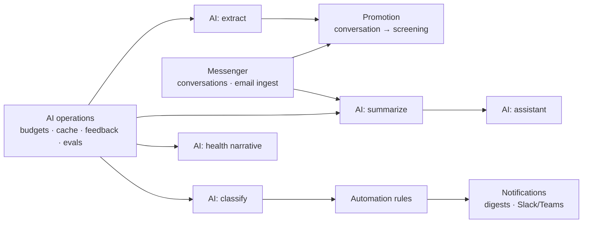

# 12 — Phase 2: Automation

> Proposal, slide 8: *Messenger integration · Notifications · AI summaries · AI classification · Project health insights*

**Goal:** AI and automation measurably improve the [Phase 1](11-phase-1-mvp.md) baseline,
at a cost that is known and bounded.

**Entry condition:** all six Phase 1 exit criteria met. Criterion 4 (baselines captured at
volume) is non-negotiable — without it this phase has nothing to prove.

## 12.1 Scope

| Workstream | Deliverable |
|---|---|
| Messenger | Conversations attached to objects, message posting, SSE streaming, email ingestion |
| Promotion | Conversation → screening with AI extraction pre-fill |
| AI: extract | Field extraction with per-field confidence, review UI, `apply-extraction` |
| AI: classify | Screening and issue classification as proposal; confidence-gated auto-apply rule |
| AI: summarize | Conversation and project-update summaries with citations |
| AI: project health | Narrative + ranked recommended actions on the health card |
| AI: assistant | Retrieval-grounded Q&A over authorized data, streamed with citations |
| Automation | Rules engine, condition/action catalogue, dry-run testing, escalation rules |
| Notifications | Preferences, digests, quiet hours, Slack/Teams adapter |
| AI operations | Budgets, caching, usage dashboard, feedback capture, eval suite in CI |

The technical design for these is in [doc 06](06-ai-layer.md) (AI tasks, cost control,
grounding, evaluation) and [doc 07](07-events-and-automation.md) (rules engine,
notifications). This document covers only how they are delivered and judged.

## 12.2 Sequencing

**AI operations ships before the first AI feature.** Budgets, caching, cost dashboards,
`ai_feedback` capture and the evaluation harness are not a hardening pass at the end of the
phase — they are the instruments by which every feature in the phase is judged. A
classifier shipped before feedback capture exists produces no evidence.

## 12.3 Rollout discipline

Each AI feature ships behind a flag and follows the same four steps:

| Step | What users see | What it produces | Promotion condition |
|---|---|---|---|
| 1. **Shadow** | Nothing | Job runs, output stored, compared against human outcomes | Output quality plausible on ≥ 30 real cases |
| 2. **Suggest** | Proposal with confidence and citations | `ai_feedback` from real dispositions | Edit-free acceptance ≥ 70% |
| 3. **Assist** | Pre-filled, one-click acceptable | Faster path, continued feedback | Sustained ≥ 70% over ≥ 200 samples |
| 4. **Auto** *(classification only)* | Applied automatically above a confidence threshold | Recorded as automation acceptance, reversible | — |

Nothing skips a step. A feature that stalls at step 2 with a poor acceptance rate has
produced a useful finding — that this task is not worth AI — which is exactly what the
pilot is for. Removing such a feature is a success of the process, not a failure of the
phase.

Step 4 applies to classification only, and only through the explicit
`apply_ai_classification` rule action with a `min_confidence` parameter
([ADR-0005](adr/0005-ai-proposes-humans-dispose.md)). Extraction, summarization and health
narratives have no autonomous mode in this phase at all.

## 12.4 Not in this phase

| Excluded | Why |
|---|---|
| AI-set status, AI-assigned owners, AI-closed issues | Deterministic software owns state transitions ([doc 06](06-ai-layer.md) §6.1) |
| AI-generated outbound messages to customers | No autonomous external communication until a human review workflow exists for it |
| AI-computed health state, progress % or scores | [ADR-0006](adr/0006-deterministic-health-ai-narrative.md) |
| Custom model training or fine-tuning | Not in any phase ([doc 01](01-overview.md) §1.5) |
| Multi-tenancy UI, billing, SSO | [Phase 3](13-phase-3-productization.md) |

## 12.5 Exit criteria

| # | Criterion | How it is checked |
|---|---|---|
| 1 | ≥ 3 KPIs improved against baseline by the target margins | `GET /v1/insights/kpis`, baseline vs. current window |
| 2 | Edit-free acceptance ≥ 70% for extraction and classification | `ai_feedback` aggregation, ≥ 200 samples each |
| 3 | AI cost within budget, cost-per-screening documented | `GET /v1/ai/usage` |
| 4 | Zero incidents of AI output causing an incorrect business outcome | Incident log; `ai_outputs.applied_at` audit trail |
| 5 | Managers report the health card answers their question without follow-up | Structured interview |
| 6 | Eval suite green, with each production prompt version's scores recorded | CI evaluation reports |

Criterion 1 asks for three of six, not all six. Some KPIs are not reachable by this phase's
features — issue ownership is already structurally at 100% from Phase 1, and reporting time
improved mostly from the Phase 1 dashboard. Demanding movement on all six would push the
team to game the ones AI cannot legitimately affect.

## 12.6 Phase-specific risks

| Risk | Signal | Response |
|---|---|---|
| Cost overruns as usage grows | Budget utilisation alert at 50% / 80% | Levers are independent: debounce interval, cache hit rate, model tier, token ceiling ([doc 06](06-ai-layer.md) §6.4). Pull the cheapest one first. |
| A feature stalls at step 2 forever | Acceptance rate flat below 70% after 200 samples | Two prompt iterations with eval evidence, then remove the feature and record the finding. Do not ship it at step 3 anyway. |
| Automation rule misfires across live workflows | Fire count spike, user complaints | Dry-run gate before enablement; per-rule fire budget auto-disables; rules are data so the fix is a `PATCH`, not a deploy |
| Users accept AI output without reading it | Acceptance rate suspiciously near 100%, edits near zero | Acceptance is not by itself evidence of quality. Cross-check against golden-set evals and spot-audit applied outputs. |
| Provider outage or deprecation mid-phase | Health check failures, error rate | Provider abstraction ([doc 06](06-ai-layer.md) §6.9); platform degrades to Phase 1 behaviour rather than breaking |
| Messenger scope expands toward Slack replacement | Feature requests for general chat | Explicit non-goal ([doc 01](01-overview.md) §1.5) |

## 12.7 What this phase needs to start

- Phase 1 exit criteria signed off, with the baseline numbers published.
- A model provider contract with zero-retention terms — a procurement precondition, not a
  configuration preference ([doc 08](08-security-and-tenancy.md) §8.5).
- 30–50 hand-labeled examples per AI task, drawn from the Phase 1 production data and
  anonymized. This is the golden set; it cannot be written before Phase 1 has run, which is
  another reason the phases are ordered this way.
- A decision on the messaging integration target: email ingestion only, or Slack/Teams as
  well.
