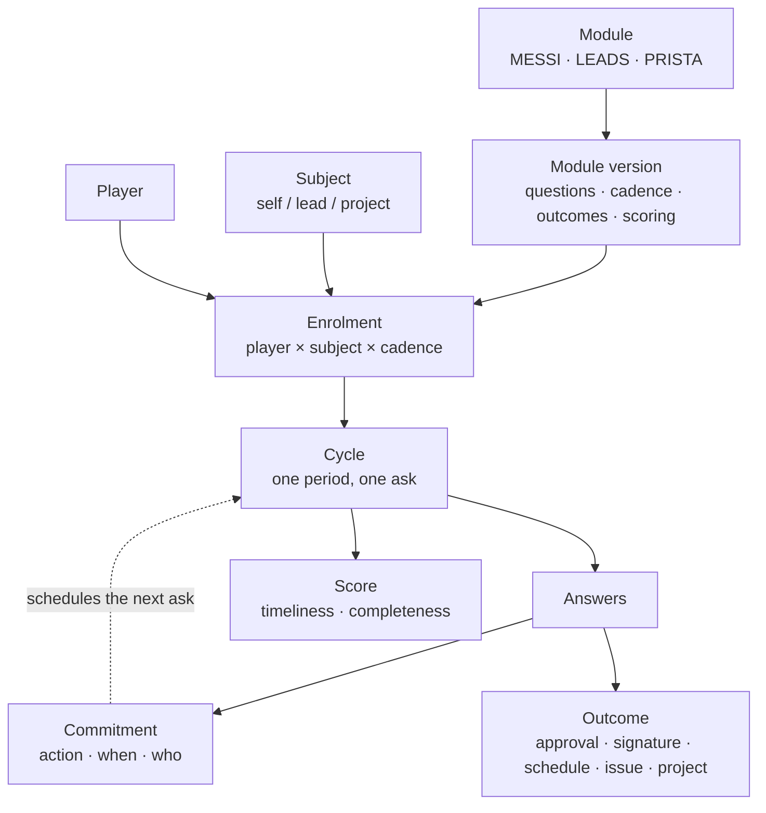
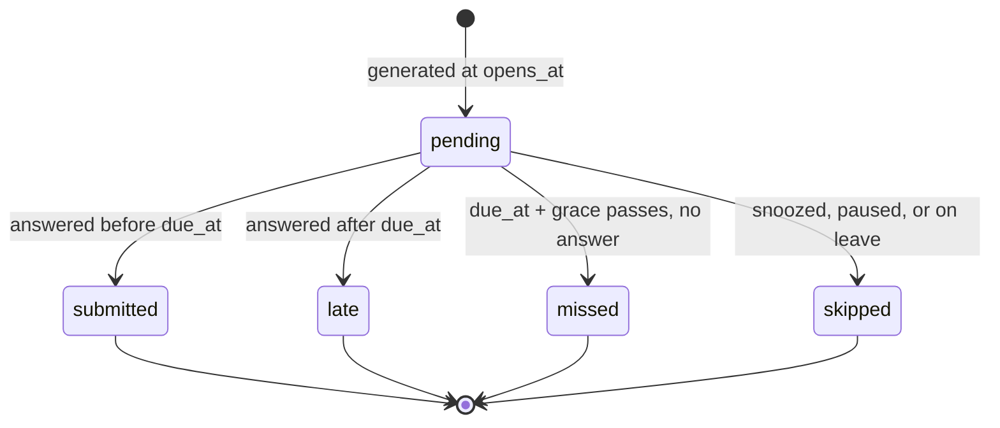
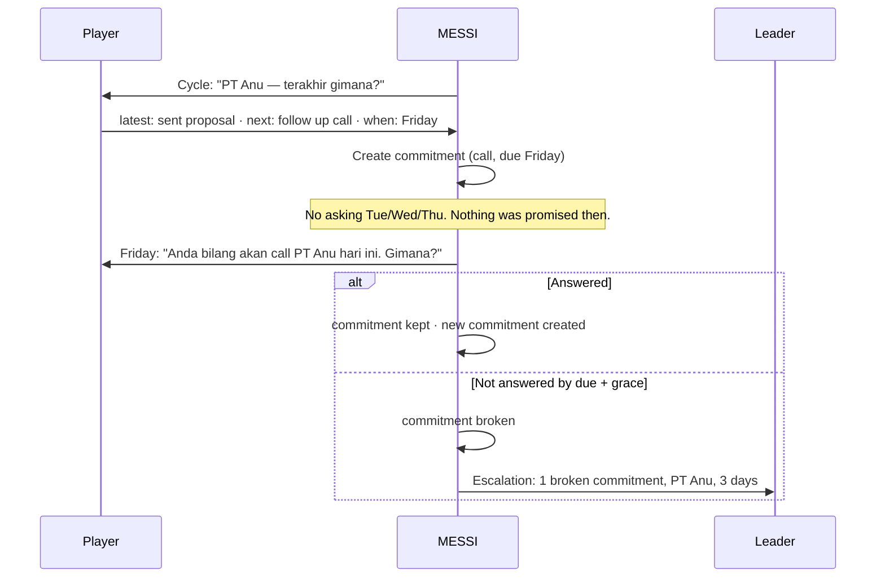

# 14 — The Follow-up Engine

> "Supaya tidak perlu kita follow up terus-menerus secara manual, nanya-nanyain."

This document describes the core of MESSI. Everything in documents 01–13 that looked like
"screening" is one instance of the machinery defined here.

## 14.1 What the engine is for

A leader currently spends their day asking people things they should not have to ask:

- *"Sudah dicek belum messenger-nya?"*
- *"Lead PT Anu gimana kabarnya?"*
- *"Project X sekarang statusnya apa?"*

Each question is cheap. Asking twenty of them, every day, to eight people, remembering who
answered and who did not, and chasing the ones who did not — that is the manual work. It
does not scale, it depends entirely on the leader's memory, and it stops the moment the
leader is busy or away.

The engine replaces the *asking*, not the *answering*. A follow-up is defined once, and the
system asks on schedule, records the answer, notices who did not answer, and turns
whatever the answer produced into a tracked object.

## 14.2 Vocabulary

The user's terms, made precise. These names are used consistently in the schema and API.

| Term | In the system | Meaning |
|---|---|---|
| **Follow-up maker** / game maker | `manager`+ role | Defines modules, enrols players, reads the leader dashboard |
| **Player** | any member | The person asked, who answers |
| **Module** | `followup_modules` | A named, reusable follow-up program — MESSI, LEADS, PRISTA |
| **Subject** | polymorphic ref | *What* is being followed up: a lead, a project, or the player themself |
| **Enrolment** | `followup_enrolments` | One standing obligation: this player, this subject, this cadence |
| **Cycle** | `followup_cycles` | One occurrence of the question for one period. The thing in the inbox. |
| **Response** | `followup_answers` | What the player answered in that cycle |
| **Commitment** | `commitments` | A promise extracted from an answer: *this action, by this date, by this person* |
| **Outcome** | `followup_outcomes` | An object created out of a response: request, issue, or project |

The distinction that matters most: a **module** is a definition, an **enrolment** is a
standing obligation, and a **cycle** is a single ask. Confusing enrolment with cycle is what
makes recurring-task systems either spam people or silently forget them.

## 14.3 Structure



The dotted line is the important one, and §14.7 is about it.

## 14.4 Module definition

A module is created in the console. Its versioned definition carries five things:

```json
{
  "key": "LEADS",
  "name": "Lead Status Report",
  "subject_type": "lead",
  "questions": [
    { "key": "latest_update", "type": "long_text", "label": "Terakhir gimana?", "required": true },
    { "key": "next_action",   "type": "long_text", "label": "Next action apa?", "required": true },
    { "key": "next_due",      "type": "date",      "label": "Kapan?", "required": true },
    { "key": "owner",         "type": "user_ref",  "label": "Siapa PIC-nya?", "required": false }
  ],
  "commitment_mapping": {
    "action": "next_action", "due": "next_due", "owner": "owner"
  },
  "cadence": { "kind": "on_commitment", "fallback": { "kind": "weekly", "weekday": "mon" } },
  "outcomes": ["approval", "signature", "schedule", "issue", "project"],
  "scoring": { "on_time": 10, "complete": 5, "commitment_kept": 15 }
}
```

Module versions are immutable once a cycle has used them, exactly as screening templates
were ([doc 03](03-domain-model.md) §3.3). Changing a question creates a new version, so
answers stay comparable across time and the scoring stays honest.

`commitment_mapping` is what turns three ordinary questions into a scheduling signal. A
module that does not declare it still works — it just cannot use commitment-driven cadence.

## 14.5 Subjects

| `subject_type` | Subject | Example module |
|---|---|---|
| `self` | The player themself | MESSI — "check your messengers" |
| `lead` | A customer or contact | LEADS — "how is PT Anu going?" |
| `project` | A project | PRISTA — "how is project X going?" |
| `issue` | A single issue | Chasing one blocker |
| `custom` | Any entity registered in the org's schema registry | Phase 3 |

One engine, three modules, because the only thing that differs is *what is asked about*.
This is why LEADS and PRISTA can share the identical four questions — the user noticed this
themselves: *"project juga sama pertanyaannya tiga… bedanya itu aja."*

## 14.6 Cadence and cycle generation

```json
{ "kind": "daily",         "days": ["mon","tue","wed","thu","fri"], "at": "09:00", "due_after": "PT9H" }
{ "kind": "weekly",        "weekday": "mon", "at": "09:00", "due_after": "P1D" }
{ "kind": "every_n_days",  "n": 3, "anchor": "2026-09-01" }
{ "kind": "monthly",       "day": 1 }
{ "kind": "on_commitment", "fallback": { "kind": "weekly", "weekday": "mon" } }
{ "kind": "once" }
```

All times resolve in the organization's timezone (`Asia/Jakarta` by default) against its
business calendar, both already in `organizations.settings`.

**Generation.** A scheduled job runs hourly. For every active enrolment it computes the
current `period_key` and upserts a cycle:

| Cadence | `period_key` |
|---|---|
| daily | `2026-08-28` |
| weekly | `2026-W35` |
| monthly | `2026-08` |
| every_n_days | `2026-08-28` (the anchor-aligned date) |
| on_commitment | `c:<commitment_id>` |
| once | `once` |

`UNIQUE (enrolment_id, period_key)` makes generation idempotent. The hourly job can run
twice, three workers can race it, and the outcome is one cycle — the same `SKIP LOCKED` and
natural-key idempotency already used everywhere else
([ADR-0004](adr/0004-postgres-backed-jobs-and-outbox.md)).

**Cycle lifecycle:**



`missed` is a recorded fact, not an absence of a record. This is the whole point: the
leader's question is no longer *"did you check?"* but *"three cycles were missed last
week"* — which the system answers without anyone asking.

## 14.7 Commitment-driven cadence

**This is the most important design decision in this document.**

A naive recurring follow-up asks every player about every subject every day. With 8 players
and 20 leads, that is 160 questions a day. Within two weeks the answers become
*"masih follow up"* pasted into every box, and the data is worthless. The system becomes the
nagging it was built to remove.

The fix is already inside the user's own question set. The third question — *"Kapan?"* — is
not just a field. It is a **commitment**, and it tells the system when to ask next.



Three consequences, all of them the point of the system:

1. **Cadence is earned, not imposed.** A player who says "Friday" is asked on Friday. They
   set their own rhythm and the system holds them to it.
2. **The leader stops chasing and starts reading exceptions.** The dashboard is not "who
   filled the form" but *"which promises were broken"*. Kept commitments need no attention
   at all.
3. **It produces the KPI that actually matters.** **Commitment-kept rate** — promises met
   on time ÷ promises made — measures follow-through. Submission rate only measures
   form-filling. See §14.11.

A fallback cadence still applies, so a subject with no live commitment is not forgotten
entirely — it just drops to a slow heartbeat (weekly, monthly) instead of a daily drumbeat.

Recorded as [ADR-0008](adr/0008-commitment-driven-cadence.md).

## 14.8 Anti-fatigue mechanisms

Commitment-driven cadence is the main defence. Four more, because follow-up fatigue is the
single most likely way this product dies:

| Mechanism | How it works |
|---|---|
| **Per-subject cadence** | Cadence lives on the *enrolment*, not the module. A hot lead is daily, a warm lead weekly, a cold lead monthly. One module serves all three. |
| **"Tidak ada perubahan" is a first-class answer** | One tap, recorded, scored as on-time. Forcing prose produces fake prose. A real "no change" is data; *"masih follow up"* typed to escape a required field is not. |
| **Cadence auto-decay** | Three consecutive no-change cycles → the system *proposes* halving the cadence. The leader approves. Subjects that have gone quiet stop consuming attention automatically. |
| **Duplicate-answer detection** | Identical consecutive `latest_update` text is flagged on the leader dashboard. Not punished — it is a signal that the cadence is wrong, or that the subject should be archived. |
| **Snooze with reason** | Explicit, time-boxed, visible. A player on leave or a lead on hold produces `skipped`, not `missed`. Unexplained silence stays distinguishable from explained silence. |

The design principle behind all five: **the system should ask less over time, not more.** Any
mechanism that only ever adds questions is a mechanism that will eventually be ignored
wholesale.

## 14.9 Scoring and job goals

Each cycle can earn points, which roll up into the player's job goal for the period.

| Component | Default | Measures |
|---|---|---|
| On time | 10 | Answered before `due_at` |
| Complete | 5 | All required questions answered |
| Commitment kept | 15 | The previous cycle's promise was met by its date |

**An honest warning, and it should be read before turning scoring on.** Points measure
*compliance*, not results. The moment points become the goal, players optimise for
submitting — fast, empty, on time. Three rules keep this from happening:

1. **Weight commitment-kept highest.** It is the only component that requires real work
   outside the form. Filling the form on time earns 15; actually doing what you promised
   earns 15 more.
2. **Never score answer "quality" with a model.** An AI-scored answer teaches players to
   write for the model. This is excluded in every phase
   ([ADR-0005](adr/0005-ai-proposes-humans-dispose.md)).
3. **Report points beside outcomes, never instead of them.** Leads converted and issues
   closed sit on the same dashboard row as points earned. If points rise while outcomes
   stay flat, the scoring is being gamed and that must be visible.

Scoring is off by default and enabled per module. A team should live with the follow-ups
for a few weeks before points are attached to them.

## 14.10 The inbox

The player's single surface. `GET /v1/inbox` returns, in priority order:

1. **Overdue commitments** — you promised, the date passed
2. **Cycles due today** — grouped by module
3. **Requests awaiting you** — approvals, signatures, meeting confirmations (§15)
4. **Cycles due later this week** — visible, not demanding

The leader's surface is the mirror image: not a list of everyone's answers, but exceptions —
missed cycles, broken commitments, flagged duplicate answers, subjects proposed for
cadence decay or archiving.

A leader who reads every answer has not been relieved of anything. The dashboard is
designed so that **an all-green day requires zero reading**.

## 14.11 Schema

Follows the conventions in [doc 04](04-data-model.md) §4.1 — UUID v7 keys,
`organization_id` on every table, composite foreign keys, soft delete, optimistic
concurrency.

```sql
CREATE TYPE subject_type AS ENUM ('self','lead','project','issue','custom');

CREATE TABLE followup_modules (
    id              UUID PRIMARY KEY,
    organization_id UUID NOT NULL REFERENCES organizations(id),
    key             TEXT NOT NULL,              -- 'MESSI', 'LEADS', 'PRISTA'
    name            TEXT NOT NULL,
    description     TEXT,
    subject_kind    subject_type NOT NULL,
    status          TEXT NOT NULL DEFAULT 'draft'
                    CHECK (status IN ('draft','active','paused','archived')),
    created_by      UUID REFERENCES users(id),
    created_at      TIMESTAMPTZ NOT NULL DEFAULT now(),
    updated_at      TIMESTAMPTZ NOT NULL DEFAULT now(),
    deleted_at      TIMESTAMPTZ,
    UNIQUE (organization_id, key),
    UNIQUE (organization_id, id)
);

CREATE TABLE followup_module_versions (
    id              UUID PRIMARY KEY,
    organization_id UUID NOT NULL,
    module_id       UUID NOT NULL,
    version         INTEGER NOT NULL,
    questions       JSONB NOT NULL,             -- ordered question definitions
    cadence         JSONB NOT NULL,             -- default cadence (§14.6)
    commitment_mapping JSONB,                   -- action/due/owner question keys
    outcomes        TEXT[] NOT NULL DEFAULT '{}',
    scoring         JSONB NOT NULL DEFAULT '{}',
    published_at    TIMESTAMPTZ,
    created_at      TIMESTAMPTZ NOT NULL DEFAULT now(),
    FOREIGN KEY (organization_id, module_id)
        REFERENCES followup_modules (organization_id, id) ON DELETE CASCADE,
    UNIQUE (module_id, version),
    UNIQUE (organization_id, id)
);

CREATE TABLE followup_enrolments (
    id              UUID PRIMARY KEY,
    organization_id UUID NOT NULL REFERENCES organizations(id),
    module_id       UUID NOT NULL,
    module_version_id UUID NOT NULL,
    player_user_id  UUID NOT NULL REFERENCES users(id),
    subject_kind    subject_type NOT NULL,
    subject_id      UUID,                       -- NULL when subject_kind = 'self'
    cadence         JSONB,                      -- overrides the module default
    timezone        TEXT NOT NULL DEFAULT 'Asia/Jakarta',
    active_from     DATE NOT NULL DEFAULT CURRENT_DATE,
    active_until    DATE,
    paused_until    DATE,
    pause_reason    TEXT,
    no_change_streak SMALLINT NOT NULL DEFAULT 0,
    version         INTEGER NOT NULL DEFAULT 1,
    created_at      TIMESTAMPTZ NOT NULL DEFAULT now(),
    updated_at      TIMESTAMPTZ NOT NULL DEFAULT now(),
    deleted_at      TIMESTAMPTZ,
    FOREIGN KEY (organization_id, module_id)
        REFERENCES followup_modules (organization_id, id),
    FOREIGN KEY (organization_id, module_version_id)
        REFERENCES followup_module_versions (organization_id, id),
    CONSTRAINT ck_enrolment_subject CHECK (
        (subject_kind = 'self' AND subject_id IS NULL)
        OR (subject_kind <> 'self' AND subject_id IS NOT NULL)
    ),
    UNIQUE (organization_id, id)
);
-- one standing obligation per player per subject per module
CREATE UNIQUE INDEX uq_enrolment_active ON followup_enrolments
    (module_id, player_user_id, subject_kind, COALESCE(subject_id, '00000000-0000-0000-0000-000000000000'::uuid))
    WHERE deleted_at IS NULL;
CREATE INDEX ix_enrolments_generation ON followup_enrolments (organization_id, module_id)
    WHERE deleted_at IS NULL AND paused_until IS NULL;

CREATE TYPE cycle_status AS ENUM ('pending','submitted','late','missed','skipped');

CREATE TABLE followup_cycles (
    id              UUID PRIMARY KEY,
    organization_id UUID NOT NULL REFERENCES organizations(id),
    enrolment_id    UUID NOT NULL,
    module_version_id UUID NOT NULL,
    period_key      TEXT NOT NULL,              -- '2026-08-28', '2026-W35', 'c:<uuid>'
    opens_at        TIMESTAMPTZ NOT NULL,
    due_at          TIMESTAMPTZ NOT NULL,
    status          cycle_status NOT NULL DEFAULT 'pending',
    submitted_at    TIMESTAMPTZ,
    submitted_by    UUID REFERENCES users(id),
    no_change       BOOLEAN NOT NULL DEFAULT false,
    triggered_by_commitment_id UUID,
    skip_reason     TEXT,
    version         INTEGER NOT NULL DEFAULT 1,
    created_at      TIMESTAMPTZ NOT NULL DEFAULT now(),
    FOREIGN KEY (organization_id, enrolment_id)
        REFERENCES followup_enrolments (organization_id, id) ON DELETE CASCADE,
    UNIQUE (enrolment_id, period_key),          -- idempotent generation
    UNIQUE (organization_id, id)
);
CREATE INDEX ix_cycles_inbox ON followup_cycles (organization_id, status, due_at)
    WHERE status = 'pending';
CREATE INDEX ix_cycles_reaper ON followup_cycles (due_at) WHERE status = 'pending';

CREATE TABLE followup_answers (
    id              UUID PRIMARY KEY,
    organization_id UUID NOT NULL,
    cycle_id        UUID NOT NULL,
    question_key    TEXT NOT NULL,
    value_raw       TEXT,
    value_json      JSONB,
    origin          TEXT NOT NULL DEFAULT 'human'
                    CHECK (origin IN ('human','integration','ai_extracted')),
    confidence      REAL,
    created_at      TIMESTAMPTZ NOT NULL DEFAULT now(),
    FOREIGN KEY (organization_id, cycle_id)
        REFERENCES followup_cycles (organization_id, id) ON DELETE CASCADE,
    UNIQUE (cycle_id, question_key)
);

CREATE TYPE commitment_status AS ENUM ('open','kept','broken','cancelled','superseded');

CREATE TABLE commitments (
    id              UUID PRIMARY KEY,
    organization_id UUID NOT NULL REFERENCES organizations(id),
    cycle_id        UUID NOT NULL,
    enrolment_id    UUID NOT NULL,
    action_text     TEXT NOT NULL,
    due_at          TIMESTAMPTZ NOT NULL,
    owner_user_id   UUID REFERENCES users(id),
    status          commitment_status NOT NULL DEFAULT 'open',
    resolved_at     TIMESTAMPTZ,
    resolved_cycle_id UUID,
    created_at      TIMESTAMPTZ NOT NULL DEFAULT now(),
    FOREIGN KEY (organization_id, cycle_id)
        REFERENCES followup_cycles (organization_id, id) ON DELETE CASCADE,
    FOREIGN KEY (organization_id, enrolment_id)
        REFERENCES followup_enrolments (organization_id, id) ON DELETE CASCADE,
    UNIQUE (organization_id, id)
);
CREATE INDEX ix_commitments_due ON commitments (organization_id, due_at)
    WHERE status = 'open';
CREATE INDEX ix_commitments_owner ON commitments (owner_user_id, status, due_at);

CREATE TABLE followup_outcomes (
    id              UUID PRIMARY KEY,
    organization_id UUID NOT NULL,
    cycle_id        UUID NOT NULL,
    outcome_kind    TEXT NOT NULL
                    CHECK (outcome_kind IN ('approval','signature','schedule','issue','project')),
    target_type     TEXT NOT NULL,              -- 'request' | 'issue' | 'project'
    target_id       UUID NOT NULL,
    created_by      UUID REFERENCES users(id),
    created_at      TIMESTAMPTZ NOT NULL DEFAULT now(),
    FOREIGN KEY (organization_id, cycle_id)
        REFERENCES followup_cycles (organization_id, id) ON DELETE CASCADE,
    UNIQUE (cycle_id, target_type, target_id)
);

CREATE TABLE followup_scores (
    cycle_id        UUID PRIMARY KEY,
    organization_id UUID NOT NULL,
    player_user_id  UUID NOT NULL REFERENCES users(id),
    period_key      TEXT NOT NULL,
    on_time_points  SMALLINT NOT NULL DEFAULT 0,
    complete_points SMALLINT NOT NULL DEFAULT 0,
    commitment_points SMALLINT NOT NULL DEFAULT 0,
    total_points    SMALLINT NOT NULL DEFAULT 0,
    computed_at     TIMESTAMPTZ NOT NULL DEFAULT now()
);
CREATE INDEX ix_scores_player ON followup_scores (organization_id, player_user_id, period_key);
```

### Schema verification

Applied to a live PostgreSQL 16 instance alongside the base schema (38 tables total, 0
errors) and the guarantees exercised:

| Check | Result |
|---|---|
| Lead enrolment with no `subject_id` | Rejected by `ck_enrolment_subject` |
| Self enrolment carrying a `subject_id` | Rejected by `ck_enrolment_subject` |
| Duplicate self enrolment (same player + module) | Rejected by `uq_enrolment_active` |
| Duplicate lead enrolment (same player + lead + module) | Rejected by `uq_enrolment_active` |
| Hourly generator running twice for one period | One cycle, not two |
| Commitment-keyed cycle beside a daily cycle | Coexist — different `period_key` |
| Missed-cycle reaper on overdue `pending` rows | Marked `missed`, on-time rows untouched |

The `COALESCE(subject_id, …)` in `uq_enrolment_active` is load-bearing: a plain unique index
would let a player be enrolled in a `self` module any number of times, because `NULL` never
equals `NULL`.

## 14.12 API surface

```
GET    /v1/inbox                              cycles due, overdue commitments, requests
GET    /v1/followup/modules
POST   /v1/followup/modules
POST   /v1/followup/modules/{id}/versions
POST   /v1/followup/modules/{id}/publish
GET    /v1/followup/modules/{id}/enrolments
POST   /v1/followup/enrolments                { module_id, player_user_id, subject, cadence? }
POST   /v1/followup/enrolments/bulk           enrol a team across a set of subjects
PATCH  /v1/followup/enrolments/{id}           cadence override, pause, resume
GET    /v1/followup/cycles                    ?player=me&status=pending
GET    /v1/followup/cycles/{id}
PUT    /v1/followup/cycles/{id}/answers       bulk upsert, validated against module version
POST   /v1/followup/cycles/{id}/submit        → creates commitments + scores
POST   /v1/followup/cycles/{id}/no-change     one-tap answer
POST   /v1/followup/cycles/{id}/snooze        { until, reason }
POST   /v1/followup/cycles/{id}/outcomes      { kind, payload } → request / issue / project
GET    /v1/commitments                        ?owner=me&status=open&due_before=
POST   /v1/commitments/{id}/resolve           { status: kept|cancelled, note }
GET    /v1/followup/dashboard                 leader view: exceptions only
GET    /v1/followup/scores                    ?period=&player=
```

## 14.13 Events

Added to the catalogue in [doc 07](07-events-and-automation.md) §7.3:

| Domain | Events |
|---|---|
| Cycle | `cycle.generated` `.submitted` `.late` `.missed` `.snoozed` `.no_change_reported` |
| Commitment | `commitment.created` `.kept` `.broken` `.cancelled` |
| Enrolment | `enrolment.created` `.cadence_changed` `.paused` `.decay_proposed` |
| Module | `module.published` `.version_created` |

`commitment.broken` is the escalation trigger — an automation rule notifies the leader,
raises the subject on the dashboard, and optionally creates an issue. This is where the
existing rules engine ([doc 07](07-events-and-automation.md) §7.5) earns its keep with no
new machinery.

## 14.14 KPIs this adds

Extends the scorecard in [doc 10](10-delivery-plan.md) §10.3:

| KPI | Definition | Why it matters |
|---|---|---|
| **Commitment-kept rate** | Commitments resolved `kept` by their due date ÷ commitments made | The real measure of follow-through. This is the number the whole system exists to move. |
| **Cycle response rate** | Cycles `submitted` or `late` ÷ cycles generated | Adoption. If this falls, the cadence is wrong before the people are. |
| **On-time rate** | `submitted` ÷ (`submitted` + `late`) | Discipline, separated from participation |
| **Manual chase count** | Leader-initiated ad-hoc follow-ups, self-reported weekly | The baseline the product is meant to drive to zero |
| **Answer staleness** | Share of cycles whose `latest_update` is identical to the previous cycle | Early warning that the ritual has gone hollow |

**Manual chase count is the honest KPI.** The stated goal is *"tidak perlu follow up
terus-menerus secara manual."* If cycle response rate is 95% and the leader is still asking
people things in WhatsApp all day, the system has added work rather than replaced it.
Measure it by protocol — a weekly count by the leader — from the first week, before the
engine is switched on.

## 14.15 Relationship to screening

The screening model in [doc 03](03-domain-model.md) §3.3 and [doc 04](04-data-model.md) §4.4
is **a follow-up module with `cadence.kind = "once"`**: a versioned question set, one
instance, typed answers, then conversion to a project.

Rather than run two near-identical systems, screening is folded into this engine:

| Screening concept | Becomes |
|---|---|
| `screening_templates` | `followup_modules` + `followup_module_versions` |
| `screenings` | `followup_cycles` with `period_key = 'once'` |
| `screening_answers` | `followup_answers` |
| Screening → project conversion | `followup_outcomes` with `outcome_kind = 'project'` |
| Deterministic score | `followup_scores`, plus module-defined scoring rules |

The review states specific to intake screening (`in_review`, `needs_info`, `accepted`,
`rejected`) remain useful and are kept as a module-level option, not forced on every module —
a daily messenger check has no "reject" state.

Recorded as [ADR-0007](adr/0007-followup-cycles-generalize-screening.md).
