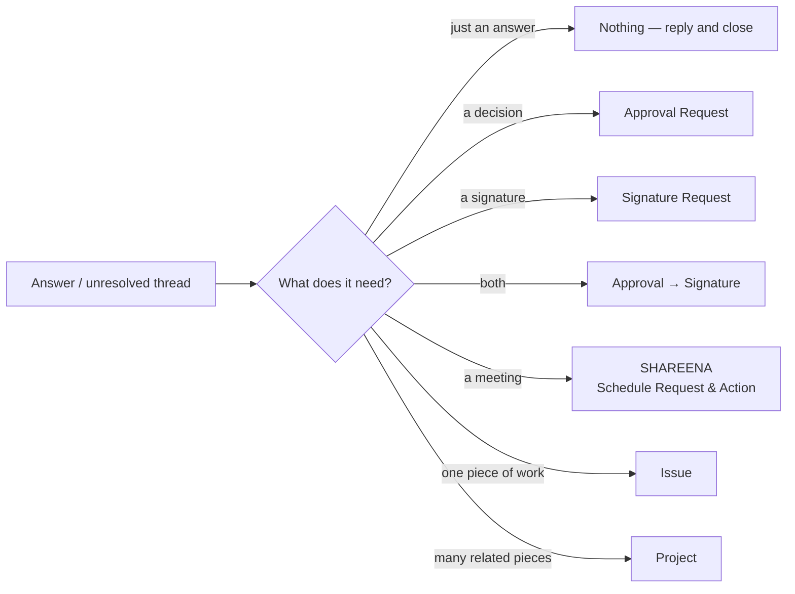
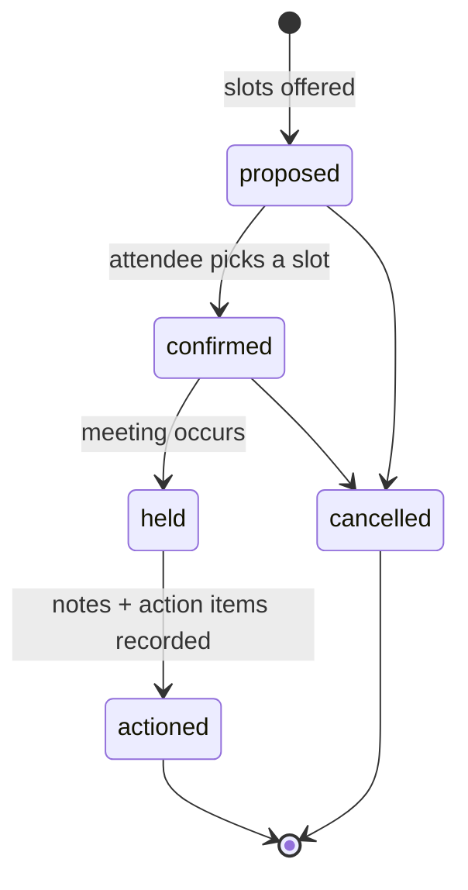

# 15 — Modules & Outcomes

The three launch modules, and the objects a follow-up answer can turn into.

## 15.1 MESSI — Messenger Screening

**Subject:** `self` · **Cadence:** daily, weekdays, due end of day · **Players:** everyone,
sales first

Every day each player confirms they have swept their messaging channels, reports the
traffic, and converts anything unresolved into a tracked object. The point is not the
count — it is that *no incoming message is silently dropped*.

### Question set

```json
{
  "key": "MESSI",
  "subject_kind": "self",
  "questions": [
    {
      "key": "channels", "type": "checklist", "label": "Channel yang dicek",
      "repeat_over": "enrolment.channels",
      "fields": [
        { "key": "checked",  "type": "boolean", "label": "Sudah dicek?" },
        { "key": "incoming", "type": "number",  "label": "Chat masuk" },
        { "key": "replied",  "type": "number",  "label": "Sudah dibalas" },
        { "key": "pending",  "type": "number",  "label": "Belum dibalas", "computed": "incoming - replied" }
      ]
    },
    { "key": "unresolved", "type": "thread_list", "label": "Yang belum selesai",
      "convertible_to": ["approval","signature","schedule","issue","project"] },
    { "key": "notes", "type": "long_text", "label": "Catatan", "required": false }
  ],
  "cadence": { "kind": "daily", "days": ["mon","tue","wed","thu","fri"], "at": "09:00", "due_after": "PT9H" }
}
```

`pending = incoming − replied` is **computed, never typed**. A player cannot report 20 in,
20 replied, and 5 pending. Arithmetic the system can do, the system does — the same
principle that keeps project health deterministic
([ADR-0006](adr/0006-deterministic-health-ai-narrative.md)).

Each row in `unresolved` is a thread that needs something. That something is one of the
outcomes in §15.4 — and until it is created, the cycle is not complete. This is the
mechanism behind *"supaya nggak keskip bales chatnya"*: an unreplied thread has to become a
tracked object or be explicitly dismissed. It cannot simply be forgotten.

### Channel integration — what is actually possible

The user asked how incoming and replied counts can be made to *"nyambung"* — connected to
the real chat rather than typed from memory. The honest answer differs sharply by channel,
and it should be known before designing around it:

| Channel | Official API | Can MESSI read message counts? |
|---|---|---|
| **WhatsApp Business Platform** (Cloud API) | Yes — webhooks for inbound and outbound | **Yes**, for numbers registered to a WABA |
| **Personal WhatsApp** | **No public API** | **No.** Unofficial web-automation libraries breach WhatsApp's terms and get numbers banned — including the business's own number. |
| **Telegram** — bot in a group | Bot API | **Yes**, straightforwardly |
| **Telegram** — personal DMs | MTProto client libraries | Technically possible, operationally fragile; treat as unsupported |
| **Email** | IMAP / SES inbound | **Yes** |
| **Instagram / Facebook DM** | Messenger Platform API | Yes, for business accounts |

**Recommendation.** Do not build the product on automated reading of personal WhatsApp. It
is the channel most Indonesian sales teams actually use, and it is precisely the one with no
legitimate API. Building on an unofficial library means the core feature breaks on
WhatsApp's schedule, and the penalty lands on the company's own number.

Instead, a two-step path that does not require the decision now:

1. **Self-reported first.** The player types the counts. Cheap, works on day one, works on
   every channel including personal WhatsApp. The value of MESSI is the discipline and the
   conversion of unresolved threads — not the accuracy of a number.
2. **Backfill where legitimate.** For WhatsApp Business, Telegram bots and email, an
   integration writes the same answers with `origin = 'integration'` instead of `'human'`.

The schema already supports this: `followup_answers.origin` is the same mechanism used for
AI-extracted fields ([doc 04](04-data-model.md) §4.4). The leader dashboard can then show
which counts are verified and which are self-reported, side by side, with no redesign.

A useful middle option: for personal WhatsApp, the player pastes an exported chat list or
uploads a screenshot, and extraction fills the counts as a *proposal* they confirm
([ADR-0005](adr/0005-ai-proposes-humans-dispose.md)). Assistive, legitimate, no ToS
exposure.

## 15.2 LEADS — Lead Status Report

**Subject:** `lead` · **Cadence:** commitment-driven, weekly fallback · **Players:** sales

The four questions, exactly as the user specified them:

| Key | Label | Type | Purpose |
|---|---|---|---|
| `latest_update` | Terakhir gimana? | long_text | What happened since the last promise |
| `next_action` | Next action apa? | long_text | The player proposes the next step themselves |
| `next_due` | Kapan? | date | **Becomes the commitment date** |
| `owner` | Siapa PIC-nya? | user_ref | Optional; defaults to the player |

`next_action` is deliberately open text answered by the player, not a dropdown chosen for
them. The user's reasoning was explicit: *"supaya si team player ini bisa mikir sendiri,
bisa inisiatif, bisa proaktif."* A dropdown of pre-set next actions would destroy exactly
the behaviour the module exists to produce.

`commitment_mapping` binds `next_action` → `next_due` → `owner` into a commitment, so LEADS
runs on the cadence in [doc 14](14-followup-engine.md) §14.7: the player is asked on the day
they said something would happen, and a missed date escalates on its own.

**Enrolment.** One per (salesperson, lead). Cadence per enrolment, so a hot lead can be
daily while a cold one is monthly, and a lead marked lost is unenrolled rather than
answered forever.

## 15.3 PRISTA — Project Status

**Subject:** `project` · **Cadence:** weekly, plus commitment-driven · **Players:** project
leads

Identical question set to LEADS — the user's own observation: *"project juga sama
pertanyaannya… bedanya itu aja."* Only `subject_kind` differs.

Two additions specific to projects:

- The cycle is **pre-filled with deterministic facts** the system already knows: open
  issues, critical blockers, overdue count, progress %, drawn from
  `project_health_snapshots` ([doc 03](03-domain-model.md) §3.4). The lead is not asked to
  retype what the system can compute — they are asked only for what it cannot know: what
  actually happened, and what happens next.
- `commitment.broken` on a project cycle feeds the project's health rules, so an unanswered
  project follow-up is itself a risk signal.

This is the clearest example of why one engine serving three modules was worth it: PRISTA
required a new `subject_kind` and a pre-fill rule, not a new subsystem.

## 15.4 Outcomes — what an answer turns into

The user's list, modelled as one abstraction with variants. Approval and signature are
*"mirip"*, as observed — both are a request to a named person for a decision, differing in
what the decision produces.



### The `requests` table

```sql
CREATE TYPE request_kind AS ENUM ('approval','signature','schedule');
CREATE TYPE request_status AS ENUM
    ('draft','open','in_progress','completed','rejected','cancelled','expired');

CREATE TABLE requests (
    id              UUID PRIMARY KEY,
    organization_id UUID NOT NULL REFERENCES organizations(id),
    kind            request_kind NOT NULL,
    title           TEXT NOT NULL,
    body            TEXT,
    requester_id    UUID NOT NULL REFERENCES users(id),
    subject_kind    TEXT,
    subject_id      UUID,
    customer_id     UUID,
    project_id      UUID,
    due_at          TIMESTAMPTZ,
    status          request_status NOT NULL DEFAULT 'open',
    sequential      BOOLEAN NOT NULL DEFAULT false,  -- approvals in order, or all at once
    payload         JSONB NOT NULL DEFAULT '{}',
    decided_at      TIMESTAMPTZ,
    source_type     TEXT,                            -- 'followup_cycle' | 'manual'
    source_id       UUID,
    version         INTEGER NOT NULL DEFAULT 1,
    created_at      TIMESTAMPTZ NOT NULL DEFAULT now(),
    updated_at      TIMESTAMPTZ NOT NULL DEFAULT now(),
    deleted_at      TIMESTAMPTZ,
    FOREIGN KEY (organization_id, project_id) REFERENCES projects (organization_id, id),
    FOREIGN KEY (organization_id, customer_id) REFERENCES customers (organization_id, id),
    UNIQUE (organization_id, id)
);
CREATE INDEX ix_requests_open ON requests (organization_id, kind, status, due_at)
    WHERE deleted_at IS NULL;

CREATE TABLE request_participants (
    id              UUID PRIMARY KEY,
    organization_id UUID NOT NULL,
    request_id      UUID NOT NULL,
    user_id         UUID NOT NULL REFERENCES users(id),
    participant_role TEXT NOT NULL
                    CHECK (participant_role IN ('approver','signer','attendee','observer')),
    position        SMALLINT NOT NULL DEFAULT 0,     -- order for sequential approvals
    response        TEXT CHECK (response IN ('approved','rejected','signed','declined','accepted','tentative')),
    responded_at    TIMESTAMPTZ,
    note            TEXT,
    FOREIGN KEY (organization_id, request_id)
        REFERENCES requests (organization_id, id) ON DELETE CASCADE,
    UNIQUE (request_id, user_id, participant_role)
);
CREATE INDEX ix_participants_inbox ON request_participants (user_id, response)
    WHERE response IS NULL;
```

### Per-kind behaviour

| Kind | `payload` carries | Completion | Produces |
|---|---|---|---|
| **approval** | policy (`all` / `any` / `quorum`), amount, category | All required approvers responded | `approved` or `rejected` + audit trail |
| **signature** | document attachment id, signing order, provider ref | All signers signed | Signed document + signature audit record |
| **schedule** (SHAREENA) | proposed slots, agenda, location or meeting link | A slot confirmed and the meeting held | Meeting notes + action items → issues |

**Approval → Signature chaining.** *"Ada yang perlu approval and assign"* — modelled as two
requests linked by `source_type='request'`, not as one dual-purpose object. The signature
request is created automatically when the approval completes, so each has its own clean
lifecycle and audit trail. Combining them into one record makes "approved but not yet
signed" unrepresentable, which is exactly the state a leader most needs to see.

**A note on signatures.** A `signature` request as designed records *that* someone signed,
with an audit trail — sufficient for internal sign-off. It is **not** a legally binding
electronic signature. If that is required, it needs a certified provider integration; in
Indonesia the relevant certified providers are **PrivyID**, **Peruri** and **VIDA**, under
UU ITE and PP 71/2019. The `payload.provider_ref` field is where that integration attaches.
Worth deciding before the module is used for customer contracts rather than internal
approvals.

### SHAREENA — Schedule Request and Action

Named per the user: *Schedule Request and Action*. The **Action** half is the part that is
usually missing from meeting tools and is the reason it belongs in a follow-up system:



A meeting cannot reach `actioned` without at least one recorded outcome — an action item, a
decision, or an explicit "no action needed". Each action item becomes an issue with an owner
and a due date, which means it becomes a **commitment**, which means the follow-up engine
now tracks it. A meeting that produces nothing is visible as a meeting that produced
nothing.

### Conversion to project

Already designed ([doc 03](03-domain-model.md) §3.2). A WhatsApp group discussion that turns
out to be a body of work becomes a project with multiple linked issues rather than a single
task. The follow-up cycle records the conversion in `followup_outcomes`, and provenance runs
back from the project to the thread that started it — so *"kenapa project ini ada?"* is one
click, not a memory exercise.

## 15.5 Module comparison

| | MESSI | LEADS | PRISTA |
|---|---|---|---|
| Subject | self | lead | project |
| Cadence | daily, weekdays | commitment-driven, weekly fallback | weekly + commitment-driven |
| Questions | checklist + unresolved threads | latest / next / when / who | latest / next / when / who |
| Pre-filled from system | — | lead stage, last contact | health metrics, open issues |
| Primary outcome | requests, issues, projects | commitments | commitments, issues |
| Main risk | becomes a rote number-typing ritual | 20 leads × daily = noise | duplicates the health dashboard |

The right-hand row is the one to watch during the pilot. Each module has a distinct way of
going hollow, and the mitigations are in [doc 14](14-followup-engine.md) §14.8.

## 15.6 Naming

`MESSI`, `PRISTA` and `SHAREENA` follow a consistent house style — pronounceable names that
expand to a description of the function. `LEADS` is a placeholder and does not fit the
pattern; it should get a name in the same style before launch. The module `key` is used in
URLs, event types and the console, so renaming later is a data migration — cheap now,
irritating in six months.
