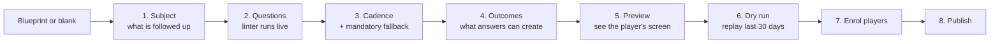

# 16 — Question Design & the Authoring Console

> *"Sebenarnya yang mau dibuat adalah bukan MESSI-nya atau PRISTA-nya, tetapi mesin pembuat
> follow-up question-nya."*

MESSI, LESTARI, PRISTA and SHERINA are the first four modules. They are not the product. The
product is the machine that lets someone define a good follow-up question for **any** domain
— a sugar mill asking about production, a workshop asking about repairs, a recruiter asking
about candidates — and have it asked, answered, tracked and analysed without a developer.

This document is about the hardest part of that machine: making sure the questions it
produces are questions worth asking.

## 16.1 Why the Telegram daily report stopped working

The team already ran daily reports in Telegram, and they became ineffective. That is the
most valuable piece of evidence available, because a system that repeats those mistakes with
a nicer UI will fail the same way — just more expensively.

Six specific failure modes, and what each one demands of the design:

| # | What went wrong in Telegram | Why it kills reporting | What the design must do |
|---|---|---|---|
| 1 | **Write-only.** Reports posted into a scroll nobody reads | Reporting into a void is the fastest way to kill the habit. People can tell when nobody reads. | Close the loop visibly — the player must see their answer was read and had an effect |
| 2 | **Unstructured.** Free-form prose | Prose cannot be counted, compared or aggregated, so "where is the bottleneck?" was never answerable. The data was never data. | Typed, structured answers with controlled vocabularies |
| 3 | **State-blind.** Same question daily whether or not anything happened | When nothing happened you must still post — so you post filler, and filler becomes indistinguishable from a real report | Commitment-driven cadence; "no change" as a legitimate one-tap answer |
| 4 | **No consequence.** The report changed nothing | Pure overhead. Nothing was created, decided or scheduled by writing it | Every answer must produce something: a commitment, an outcome, a state change |
| 5 | **Effort asymmetry.** 15 minutes to write, 10 seconds to skim | The rational response to being skimmed is to write less carefully | Pre-fill everything the system knows; keep each ask small |
| 6 | **Separate from the work.** Reporting was a second job | Admin on top of admin | Answering *is* the admin — it creates the issue, the approval, the meeting |

Failure mode 1 deserves emphasis. Structure, cadence and AI cannot rescue a system where
people believe nobody reads their answers. The leader dashboard in
[doc 14](14-followup-engine.md) §14.10 is exception-based so that a leader *can* keep up —
and every answer that triggers an action shows the player what it triggered.

## 16.2 The five tests of a follow-up question

Applied by the author, and checked by the linter in §16.4.

### Test 1 — Evidence: can it be answered without doing the work?

The single most important test. A question answerable from the sofa will be answered from
the sofa.

| Weak | Strong |
|---|---|
| "Sudah dicek messenger-nya?" | "Dari chat yang masuk hari ini, mana yang belum dibalas?" |
| "Sudah follow up PT Anu?" | "Apa jawaban PT Anu waktu di-follow up?" |

The strong version cannot be answered without having actually looked. This is what makes an
answer *evidence* rather than a *claim*.

### Test 2 — Specificity: could the answer be wrong?

An answer that cannot be wrong carries no information. Numbers, names, dates and quotes can
be wrong; *"lancar"*, *"aman"* and *"masih proses"* cannot.

| Weak | Strong |
|---|---|
| "Gimana produksinya?" | "Produksi hari ini berapa ton?" (target shown: 120) |
| "Gimana progressnya?" | "Sejak update terakhir, apa yang selesai?" |

### Test 3 — Consequence: does the answer change anything?

If an answer changes nothing in the system, delete the question. Every question should map
to a commitment, an outcome, a field update, or a rule that fires. This is the direct fix
for failure mode 4.

### Test 4 — Non-redundancy: does the system already know?

Never ask what can be computed. *"Kapan terakhir di-service?"* is in the database — asking it
wastes the player's attention and invites a wrong answer from memory.

Pre-fill it and ask the thing that follows from it instead.

### Test 5 — Thinking: does it require judgment, or only recall?

The stated purpose is *"pertanyaannya itu justru yang membuat orang jadi mikir dan kerja."*

- Recall: "Status lead ini apa?" → picks a label
- Judgment: "Next action apa, dan kapan?" → must decide something

A module made entirely of recall questions is a form. A module with at least one judgment
question is a management conversation that happens without the manager.

## 16.3 Worked example: a sugar mill

The author's first draft — a realistic one, and every question fails a test:

> *"Gimana produksi hari ini? Mesinnya dibetulin belum? Kapan terakhir di-service?"*

| Draft question | Fails | Redesigned |
|---|---|---|
| Gimana produksi hari ini? | Test 2 — *"lancar"* is unfalsifiable | **"Produksi hari ini berapa ton?"** — number, with target 120 shown beside the field |
| Mesinnya dibetulin belum? | Tests 1 & 5 — yes/no, answerable without checking | **"Mesin #3: apa yang sudah dikerjakan hari ini, dan kapan bisa jalan lagi?"** — the date becomes a commitment |
| Kapan terakhir di-service? | Test 4 — the system knows | **Pre-filled:** *"Terakhir servis: 12 Jul (47 hari lalu)"* → asks instead: **"Perlu dijadwalkan sekarang?"** → creates a SHERINA request |

And one question added that was not in the draft, because it is the one that makes the whole
module analysable:

> **If output < target:** *"Penyebab utamanya apa?"* → `[ mesin · bahan baku · tenaga kerja · cuaca · supplier · listrik · lainnya ]` + detail

### Why the cause question matters more than it looks

**Analytics quality is decided at question-design time, not at analysis time.** You cannot
AI your way out of unstructured filler. If the cause of a missed target is buried in prose —
or never asked — then no model, however good, will later tell management whether the
bottleneck is the machine, the supplier or the weather. It will only produce a fluent
paragraph that sounds like it knows.

One controlled-vocabulary field, captured at the moment the person actually knows the
answer, is worth more than a year of retrospective text mining. This field is what makes
[doc 17](17-answer-analysis.md) possible.

The free-text detail beside it is still captured — it is where a cause nobody anticipated
first appears, and §17.5 mines it for exactly that.

## 16.4 The question linter

Since the product is a question-making machine, the machine should make it hard to write a
bad question. The linter runs while authoring and again at publish.

**Deterministic checks** — cheap, certain, no model involved:

| Check | Severity |
|---|---|
| Boolean question with no follow-up question attached | Warning — fails Test 1 |
| Question maps to a field the system already computes | Warning — fails Test 4 |
| No question in the module maps to a commitment | Warning — the module cannot use commitment cadence |
| No question maps to an outcome or state change | Warning — fails Test 3 |
| More than 7 questions in one cycle | Warning — completion rate falls sharply beyond this |
| A `number` question with no target or comparison | Info — a number without a reference point is hard to act on |
| Free-text question where a previous version used a select | Info — aggregation will break at this version boundary |
| Module has no fallback cadence | **Blocks publish** — [ADR-0008](adr/0008-commitment-driven-cadence.md) |

**AI check** — advisory, at authoring time only, never at answering time:

The draft question is evaluated against the five tests and returns a verdict plus a
suggested rewrite. The author accepts, edits or ignores it — it is a proposal, exactly like
every other AI output in this system ([ADR-0005](adr/0005-ai-proposes-humans-dispose.md)).

```json
{
  "question": "Mesinnya dibetulin belum?",
  "verdict": "weak",
  "failed_tests": ["evidence", "thinking"],
  "reason": "Yes/no question answerable without inspecting the machine.",
  "suggested_rewrite": "Mesin #3: apa yang sudah dikerjakan hari ini, dan kapan bisa jalan lagi?",
  "suggested_type": "long_text + date",
  "confidence": 0.86
}
```

This is the highest-value place for AI in the whole product, and it is worth being explicit
about why: **it acts once, on the author, before any player is ever asked.** A better
question improves every future answer from every player. Compare that with scoring answers
after the fact, which corrects nobody and teaches players to write for a model.

Recorded as [ADR-0010](adr/0010-question-quality-gated-at-authoring.md).

## 16.5 Question types

| Type | Use | Analysable as |
|---|---|---|
| `number` | Output, counts, amounts — with optional target | Trend, variance vs target |
| `select` / `cause_code` | Controlled vocabulary, especially causes | **Aggregation — the backbone of §17** |
| `multi_select` | Several applicable tags | Co-occurrence |
| `long_text` | Judgment: what happened, what next | Themes, embeddings, quality signal |
| `date` | Commitment dates | Commitment tracking |
| `user_ref` | PIC assignment | Ownership, load |
| `boolean` | Only with a mandatory follow-up | Weak on its own |
| `checklist` | Repeating rows over a set (channels, machines, sites) | Per-row completion |
| `thread_list` | Items needing conversion to outcomes | Outcome funnel |
| `stage` | Where the subject has reached, from a module-declared list | **Funnel, time-in-stage, stall detection** |

`stage` answers *"ini udah sampai mana?"* deterministically. Each module declares its stages
— for LESTARI: `contacted → qualified → proposal → negotiation → won/lost`; for a mill:
`normal → degraded → stopped`. Time-in-stage and stall detection then need no AI at all.

### Conditional questions

Questions can depend on earlier answers in the same cycle:

```json
{
  "key": "shortfall_cause",
  "type": "cause_code",
  "label": "Penyebab utamanya apa?",
  "options": ["mesin","bahan_baku","tenaga_kerja","cuaca","supplier","listrik","lainnya"],
  "show_when": { "question": "output_tons", "op": "lt", "value": "$target" },
  "require_detail_when": ["lainnya"]
}
```

Conditionals are what let a module stay short on a good day and dig deeper on a bad one —
directly addressing failure mode 3. The player who hit target answers one question. The
player who missed answers three, at the moment they know why.

## 16.6 Blueprints

The console ships with starting points, because a blank module builder produces the same
weak questions every time.

| Blueprint | Subject | Core questions |
|---|---|---|
| Daily channel sweep (MESSI) | self | Checklist per channel, unresolved threads, conversions |
| Lead follow-up (LESTARI) | lead | latest / next action / when / who / stage |
| Project status (PRISTA) | project | Pre-filled health + latest / next / when |
| Operations daily | site or line | Output vs target, cause on shortfall, blockers |
| Asset maintenance | asset | Pre-filled last service, condition, schedule request |
| Recruitment pipeline | candidate | stage / next action / when |

A blueprint is a module version like any other — cloned, then edited. It carries the tests
already passed, so the author starts from something that lints clean.

## 16.7 The authoring console



**Preview** renders the cycle exactly as the player sees it, with pre-filled values from real
data. Authors consistently underestimate how long their own module takes to answer; seeing
it is the cheapest correction.

**Dry run** replays the module against the last 30 days: how many cycles would have been
generated, for whom, how many commitments, how much would have been asked on a quiet day.
A module that would have generated 400 cycles a week is caught before anyone is enrolled,
not after they stop answering.

**Change impact.** Editing a published question warns which past answers stop being
comparable, and offers to keep the old question as deprecated so trend data survives the
boundary. This matters because module versions are immutable
([doc 14](14-followup-engine.md) §14.4) and analysis groups by version.

## 16.8 Schema additions

```sql
CREATE TABLE question_reviews (
    id              UUID PRIMARY KEY,
    organization_id UUID NOT NULL REFERENCES organizations(id),
    module_version_id UUID NOT NULL,
    question_key    TEXT NOT NULL,
    source          TEXT NOT NULL CHECK (source IN ('linter','ai','human')),
    verdict         TEXT NOT NULL CHECK (verdict IN ('strong','acceptable','weak')),
    failed_tests    TEXT[] NOT NULL DEFAULT '{}',
    reason          TEXT,
    suggested_rewrite TEXT,
    confidence      REAL,
    disposition     TEXT CHECK (disposition IN ('accepted','edited','ignored')),
    reviewed_by     UUID REFERENCES users(id),
    created_at      TIMESTAMPTZ NOT NULL DEFAULT now(),
    FOREIGN KEY (organization_id, module_version_id)
        REFERENCES followup_module_versions (organization_id, id) ON DELETE CASCADE
);
CREATE INDEX ix_question_reviews_version ON question_reviews (module_version_id);

CREATE TABLE module_blueprints (
    id              UUID PRIMARY KEY,
    organization_id UUID REFERENCES organizations(id),   -- NULL = shipped with the product
    key             TEXT NOT NULL,
    name            TEXT NOT NULL,
    industry        TEXT,
    subject_kind    subject_type NOT NULL,
    definition      JSONB NOT NULL,
    created_at      TIMESTAMPTZ NOT NULL DEFAULT now()
);
CREATE UNIQUE INDEX uq_blueprints_key ON module_blueprints
    (COALESCE(organization_id, '00000000-0000-0000-0000-000000000000'::uuid), key);
```

`question_reviews.disposition` closes the loop on the linter itself: if authors ignore 80% of
AI rewrite suggestions, the suggestions are bad and the prompt needs work — measurable from
day one, the same mechanism as `ai_feedback` ([doc 04](04-data-model.md) §4.8).

## 16.9 Recommendations for the pilot

Concrete, in priority order:

1. **Start with two modules, not four.** MESSI and LESTARI. Adding modules is easy; recovering
   from a team that has learned to ignore notifications is not.
2. **Cap it at five questions per cycle** for the first month. Shorter than feels right.
3. **Rewrite the existing Telegram report format through the five tests before building it.**
   That exercise alone will surface which of the current daily questions were never worth
   asking. It costs an afternoon and can be done before any code exists.
4. **Turn scoring off for the first month** ([doc 14](14-followup-engine.md) §14.9). Let people
   answer without points attached, so the baseline shows what genuine engagement looks like.
5. **Have the leader visibly act on answers in week one.** Reply, resolve, convert. Failure
   mode 1 is decided in the first week — if the first ten answers vanish into silence, the
   pattern is set.
6. **Measure manual chase count from day one** ([doc 14](14-followup-engine.md) §14.14). It is
   the only KPI that says whether the manual asking actually stopped.
