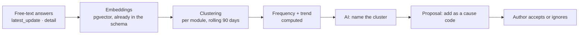

# 17 — Answer Analysis & Operational Intelligence

> *"Leader dan manajemen jadi bisa ngeliat: oh ini udah sampai mana? Ada bottleneck-nya di
> mana? Apakah di strateginya, atau di keadaan, atau di orangnya? Kalau ada satu pihak doang
> atau semua."*

Four questions. This document answers each with a named mechanism, and is explicit about
which parts are arithmetic and which parts are a model's opinion.

| Management question | Mechanism | Computed or AI |
|---|---|---|
| Udah sampai mana? | Stage funnel, time-in-stage, stall detection (§17.2) | **Computed** |
| Bottleneck-nya di mana? | Cause-code aggregation (§17.3) | **Computed** |
| Strategi, keadaan, atau orang? | Cause taxonomy + confounder display (§17.3) | Computed; AI labels free text only |
| Satu pihak atau semua? | Concentration vs. systemic test (§17.4) | **Computed** |
| Kenapa, dan sebaiknya apa? | Narrative and recommendations (§17.6) | **AI** |

The pattern is the one already established for project health
([ADR-0006](adr/0006-deterministic-health-ai-narrative.md)): every number and every verdict
is computed; the model writes the paragraph. Recorded as
[ADR-0009](adr/0009-attribution-computed-narrative-written.md).

## 17.1 The precondition

**This entire document depends on [doc 16](16-question-design.md).**

Analysis cannot recover information the questions never captured. If a missed target is
recorded as *"ada kendala"*, no model will tell management whether the problem is the
machine, the supplier or the rain — it will only produce a fluent paragraph that sounds like
it knows, which is worse than silence because people act on it.

The `cause_code` field in §16.3 is the single most important input to everything below. One
controlled-vocabulary answer, captured at the moment the person actually knows why, beats a
year of retrospective text mining.

## 17.2 "Udah sampai mana?" — progress

Entirely deterministic, from the `stage` question type ([doc 16](16-question-design.md) §16.5).

- **Funnel** — count of subjects per stage, per module, now.
- **Time-in-stage** — median and p90 days, per stage, per player, per period.
- **Stall detection** — a subject in the same stage beyond p90 for that stage is stalled.
  Threshold is derived from the team's own history, not guessed.
- **Movement** — subjects that advanced, regressed or stalled this period.

Regression matters and is easy to miss: a lead going `negotiation → qualified` is a worse
signal than one sitting still, and only shows up if stage history is kept rather than
overwritten.

```sql
CREATE TABLE subject_stage_history (
    id              BIGSERIAL PRIMARY KEY,
    organization_id UUID NOT NULL,
    module_id       UUID NOT NULL,
    subject_kind    subject_type NOT NULL,
    subject_id      UUID NOT NULL,
    from_stage      TEXT,
    to_stage        TEXT NOT NULL,
    cycle_id        UUID,
    entered_at      TIMESTAMPTZ NOT NULL DEFAULT now(),
    left_at         TIMESTAMPTZ,
    days_in_stage   INTEGER
);
CREATE INDEX ix_stage_hist_subject ON subject_stage_history (subject_kind, subject_id, entered_at);
CREATE INDEX ix_stage_hist_funnel ON subject_stage_history (organization_id, module_id, to_stage)
    WHERE left_at IS NULL;
```

## 17.3 "Bottleneck-nya di mana?" — cause aggregation

Every `cause_code` answer is a labelled data point. Aggregation over a window gives the
bottleneck directly — no model required.

### The taxonomy

Cause codes are module-defined, but each maps to one of five **classes**, which is what makes
the *"strategi / keadaan / orang"* question answerable across modules:

| Class | Meaning | Examples |
|---|---|---|
| `external` | Outside the company's control | cuaca, regulasi, customer diam, kondisi pasar |
| `process` | Internal handoff, waiting, tooling | menunggu approval, dokumen belum siap, sistem down |
| `resource` | Money, people, equipment, materials | mesin rusak, bahan baku habis, kurang orang |
| `strategy` | The approach itself is not working | harga tidak kompetitif, target segmen salah, pitch tidak nyambung |
| `capability` | Skill, capacity or engagement of a person | belum paham produk, kelebihan beban |

The author maps each code to a class when defining the module. The linter warns if a module
has no `external` option — a taxonomy with nowhere to put "it rained" forces people to
misreport, which corrupts everything downstream.

### The rule that keeps cause data honest

**Cause codes must never feed an individual's score.**

If reporting *"cuaca"* or *"menunggu approval finance"* lowers your points, people stop
reporting causes and start reporting nothing — or start reporting whichever cause is
cheapest. Within a month the field is noise, and the bottleneck analysis is worse than
having no analysis, because it looks authoritative.

So: scoring covers timeliness, completeness and commitments kept
([doc 14](14-followup-engine.md) §14.9). It never reads `cause_code`. This is enforced in the
scoring code and stated in the module builder, so authors do not reintroduce it.

## 17.4 "Satu pihak atau semua?" — concentration vs. systemic

The most useful discrimination in the whole system, and the one most likely to be got wrong.

For a cause code `C` over window `W`:

```
team_rate(C)        = cycles reporting C / cycles reporting any cause
player_rate(p, C)   = same, restricted to player p
peer_rate(p, C)     = same, all players except p
```

**Concentrated in one person** — flagged only when all three hold:

- `n(p) >= 10` cycles with a cause in the window
- `player_rate >= 2 × peer_rate`
- absolute gap `>= 15` percentage points

**Systemic** — flagged when either holds:

- `C` is the top cause for `>= 60%` of players who have `n >= 5`
- `team_rate(C) >= 40%`

### These are screening heuristics, not verdicts

At pilot scale — 8 players, perhaps 20 cycles each per month — the statistical power is low.
A two-proportion test at n=10 will not reliably separate a real difference from noise. The
thresholds above are deliberately blunt and deliberately conservative, and the output is
phrased as *a question worth asking*, never as a conclusion.

The UI shows the sample size next to every finding. A finding based on 11 cycles says so.

### Person attribution needs more care than the others

`capability` is the most consequential class to assign — it affects someone's job — and the
most likely to be confounded. Before any person-level finding is shown, the dashboard
displays alongside it the things that could explain the difference without the person being
the cause:

| Confounder | Shown as |
|---|---|
| Caseload | Subjects enrolled per player |
| Subject difficulty | Lead source, deal size, stage entered at |
| Tenure | Months in role |
| Territory or segment | Segment mix vs. peers |

Two rules follow, and both are implemented rather than advisory:

1. **Order of elimination.** `external`, `process`, `resource` and `strategy` findings are
   surfaced before `capability` findings for the same window. If the whole team is blocked on
   finance approvals, that is shown first, because it is very likely the real answer.
2. **No autonomous escalation on a person.** A `capability` finding never triggers a
   notification, an automation rule, or a score change. It appears on the leader's dashboard
   with its evidence and its sample size, and a human decides what it means. This is
   [ADR-0005](adr/0005-ai-proposes-humans-dispose.md) applied where the stakes are highest.

```sql
CREATE TYPE finding_scope AS ENUM ('systemic','concentrated','isolated');

CREATE TABLE bottleneck_findings (
    id              UUID PRIMARY KEY,
    organization_id UUID NOT NULL REFERENCES organizations(id),
    module_id       UUID NOT NULL,
    window_start    DATE NOT NULL,
    window_end      DATE NOT NULL,
    cause_code      TEXT NOT NULL,
    cause_class     TEXT NOT NULL
                    CHECK (cause_class IN ('external','process','resource','strategy','capability')),
    scope           finding_scope NOT NULL,
    subject_user_id UUID REFERENCES users(id),     -- set only when scope = 'concentrated'
    sample_size     INTEGER NOT NULL,
    occurrence_rate REAL NOT NULL,
    peer_rate       REAL,
    evidence        JSONB NOT NULL DEFAULT '{}',   -- cycle ids, confounders, counts
    computed_at     TIMESTAMPTZ NOT NULL DEFAULT now(),
    CONSTRAINT ck_finding_subject CHECK (
        (scope = 'concentrated' AND subject_user_id IS NOT NULL)
        OR (scope <> 'concentrated' AND subject_user_id IS NULL)
    ),
    CONSTRAINT ck_finding_min_sample CHECK (sample_size >= 5)
);
CREATE INDEX ix_findings_window ON bottleneck_findings
    (organization_id, module_id, window_end DESC, cause_class);
```

The `ck_finding_min_sample` constraint is deliberate: a finding from four data points cannot
be written to the table at all, so it cannot reach a dashboard by accident.

### Schema verification

Applied to live PostgreSQL 16 alongside the full schema (43 tables, 0 errors) and the
guarantees exercised:

| Check | Result |
|---|---|
| Finding built from 4 data points | Rejected by `ck_finding_min_sample` — cannot reach a dashboard by accident |
| `concentrated` finding naming nobody | Rejected by `ck_finding_subject` |
| `systemic` finding naming a person | Rejected by `ck_finding_subject` — a team-wide problem cannot be pinned on someone |
| Valid systemic + valid concentrated findings | Both stored |
| Shipped blueprint and tenant blueprint sharing a key | Both allowed |
| Two shipped blueprints sharing a key | Rejected by `uq_blueprints_key` |

The third row is the one worth having in the database rather than in a code path: it makes
"the whole team is stuck, and here is whose fault it is" structurally unrepresentable.

## 17.5 Emerging themes — where AI earns its place

Cause codes only capture causes someone anticipated. New problems arrive as free text first:
*"tim customer lagi reorganisasi"*, *"kompetitor kasih diskon 30%"*.



The loop closes: a theme that recurs becomes a proposed `cause_code`, which the author adds
to the module, after which it is captured as structured data instead of prose. The taxonomy
learns from what actually happens rather than from what was imagined at design time.

Clustering and frequency are computed. The model does one narrow job — naming a cluster —
and its proposal is accepted by a human before it changes any module.

## 17.6 The narrative

Only after everything above is computed does a model write anything. Its input is the
computed findings, not raw answers:

```json
{
  "period": "2026-08",
  "module": "LESTARI",
  "funnel": { "proposal": 14, "negotiation": 6, "won": 3 },
  "stalled": [{ "stage": "proposal", "count": 9, "p90_days": 12, "median_days": 21 }],
  "findings": [
    { "cause_code": "menunggu_approval_internal", "class": "process",
      "scope": "systemic", "rate": 0.47, "sample_size": 62 },
    { "cause_code": "harga_tidak_kompetitif", "class": "strategy",
      "scope": "systemic", "rate": 0.21, "sample_size": 62 }
  ],
  "commitment_kept_rate": 0.68
}
```

The narrative is constrained to what is in that payload, must cite the finding behind each
claim, and is rendered visually distinct from the computed numbers. If the AI layer is off,
management still sees the funnel, the stalls, the findings and the rates — everything except
the paragraph.

## 17.7 Per-answer signals

A lightweight quality signal per free-text answer:

| Signal | How | Use |
|---|---|---|
| **Similarity to previous** | Cosine distance to the same player's last answer for the same subject | Computed. High similarity = the ritual is going hollow |
| **Specificity** | Presence of numbers, dates, proper nouns | Computed |
| **Responsiveness** | Does the answer address what was asked? | AI, advisory |

Three rules, because this is where a well-meant feature turns punitive:

1. **Never shown as a player-facing score.** It is a signal that the *question or cadence* is
   wrong, aimed at the author and the leader.
2. **Used as a gentle nudge at submit time**, at most: *"Jawaban ini mirip dengan minggu lalu
   — ada perkembangan baru?"* The player can submit anyway.
3. **Never feeds points.** Same reasoning as cause codes in §17.3.

A rising similarity rate across a whole module is the earliest reliable warning that the
module is dying — earlier than response rate, which stays high while quality collapses. It
is on the leader dashboard as `answer staleness` ([doc 14](14-followup-engine.md) §14.14).

## 17.8 Performance recap

Per player, per period — computed, then narrated:

| Metric | Source |
|---|---|
| Cycle response rate, on-time rate | `followup_cycles` |
| Commitment-kept rate | `commitments` |
| Outcomes produced | `followup_outcomes` |
| Subjects advanced / stalled / regressed | `subject_stage_history` |
| Answer staleness | §17.7 |
| Caseload and difficulty mix | Enrolments + subject attributes |

The last row is not decoration. A recap that ranks players without showing caseload invites
exactly the wrong conclusion about whoever has the hardest territory.

```sql
CREATE TABLE performance_periods (
    id              UUID PRIMARY KEY,
    organization_id UUID NOT NULL REFERENCES organizations(id),
    player_user_id  UUID NOT NULL REFERENCES users(id),
    module_id       UUID,
    period_key      TEXT NOT NULL,
    metrics         JSONB NOT NULL,
    computed_at     TIMESTAMPTZ NOT NULL DEFAULT now(),
    UNIQUE (player_user_id, module_id, period_key)
);
```

## 17.9 On "big data"

At pilot scale this is **small data**, and saying so avoids building the wrong thing.

25 users × a handful of cycles per day × 250 working days ≈ **20–50 thousand answers per
year**. That is a rounding error for PostgreSQL. Every aggregation in this document is a
`GROUP BY` over an indexed table, and the clustering in §17.5 runs over embeddings already
stored in `pgvector` ([doc 04](04-data-model.md) §4.8).

So: no data warehouse, no Spark, no separate analytics store, no event pipeline. Nightly
rollups into `bottleneck_findings` and `performance_periods`, queried directly.

What *is* worth doing now is making the data accumulate cleanly — stable cause taxonomies,
versioned modules, stage history retained rather than overwritten. Those are cheap today and
impossible to reconstruct later. Revisit the infrastructure at 10⁷ answers; the schema does
not need to change before then.

## 17.10 AI tasks added

Extends the catalogue in [doc 06](06-ai-layer.md) §6.2. All follow the existing rules:
schema-validated output, stored in `ai_outputs`, promoted by a human.

| Task | When | Input | Output | Disposition |
|---|---|---|---|---|
| `question_review` | Authoring a question | Draft question + module context | Verdict, failed tests, rewrite | Author accepts / edits / ignores |
| `cause_classify` | Free-text detail given | Detail text + module taxonomy | Proposed `cause_code` | Proposal; auto-applied only above confidence threshold |
| `theme_name` | Cluster formed | Cluster exemplars | Short label + proposed cause code | Author accepts before it enters the taxonomy |
| `answer_responsiveness` | Answer submitted | Question + answer | Responsive / partial / non-responsive | Advisory nudge only, never scored |
| `ops_narrative` | Nightly rollup | **Computed findings only** | Narrative + recommended actions | Displayed beside the numbers |

`ops_narrative` receives computed findings, never raw answers. This bounds cost, keeps the
input small and structured, and makes it impossible for the model to invent a bottleneck that
the data does not contain.

## 17.11 What this does not do

Stated plainly, because analytics features attract expectations:

- **It does not predict.** No lead scoring, no win probability, no forecast. Those need far
  more history than the pilot will have, and a wrong forecast presented confidently is worse
  than no forecast.
- **It does not judge people.** `capability` findings are surfaced to a human with evidence
  and confounders. There is no performance score, no ranking, no automated consequence.
- **It does not replace the leader's judgement.** It removes the *asking*, and it surfaces
  where to look. Deciding what a bottleneck means, and what to do, stays human.
- **It is only as good as the answers.** Which is why [doc 16](16-question-design.md) is the
  more important of the two documents.
